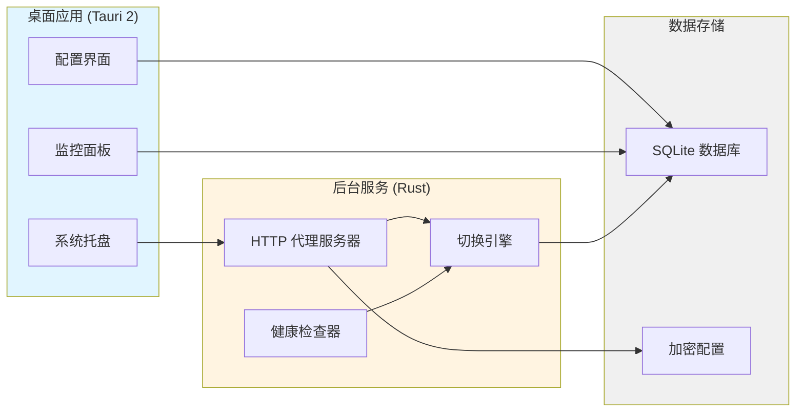
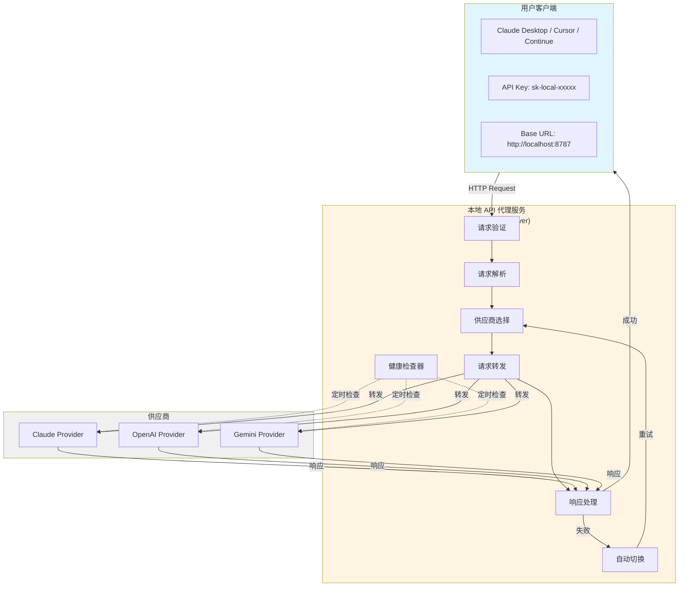
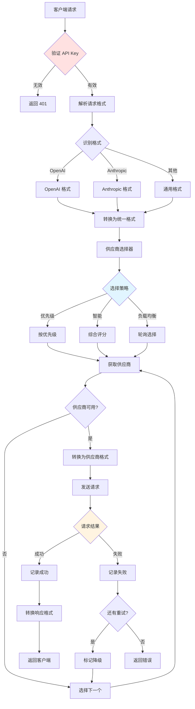
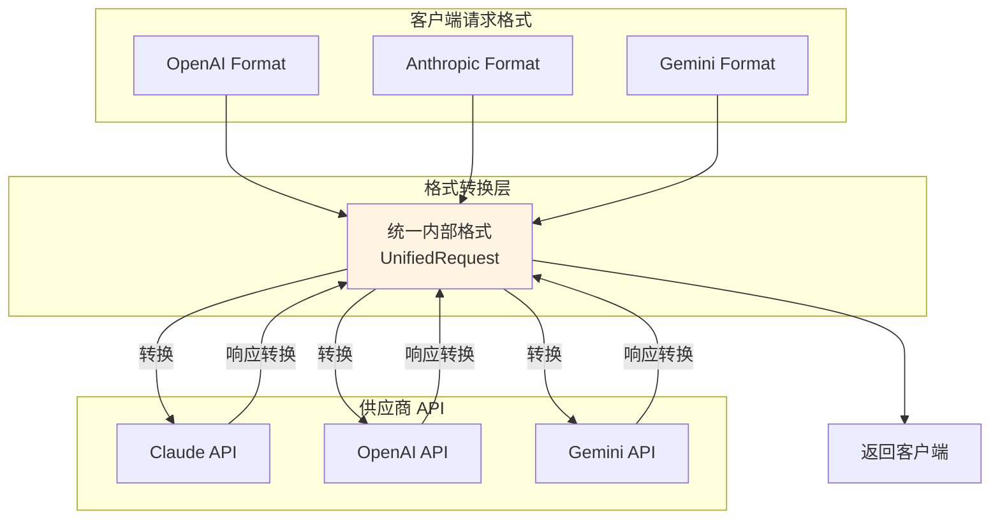
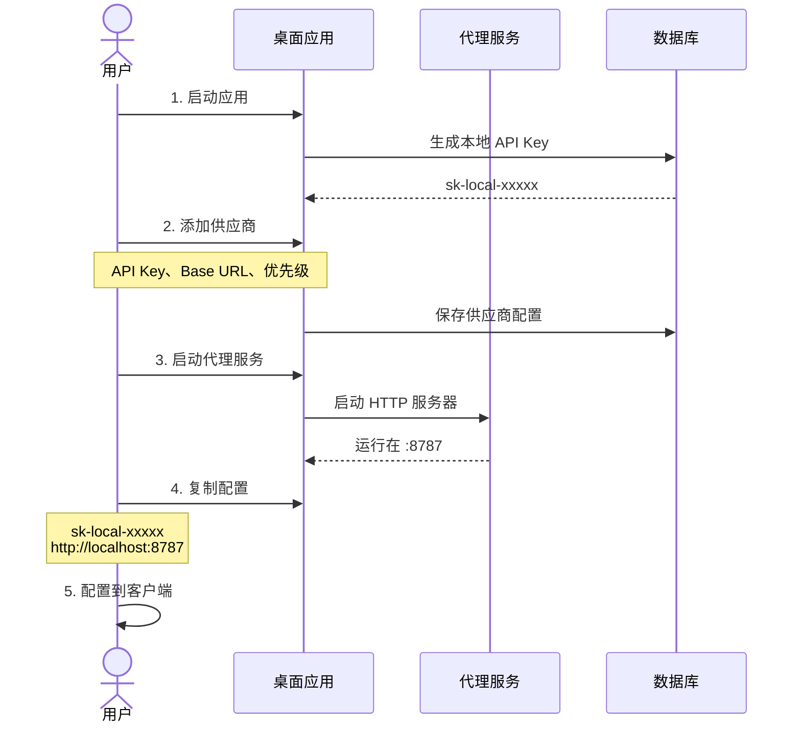
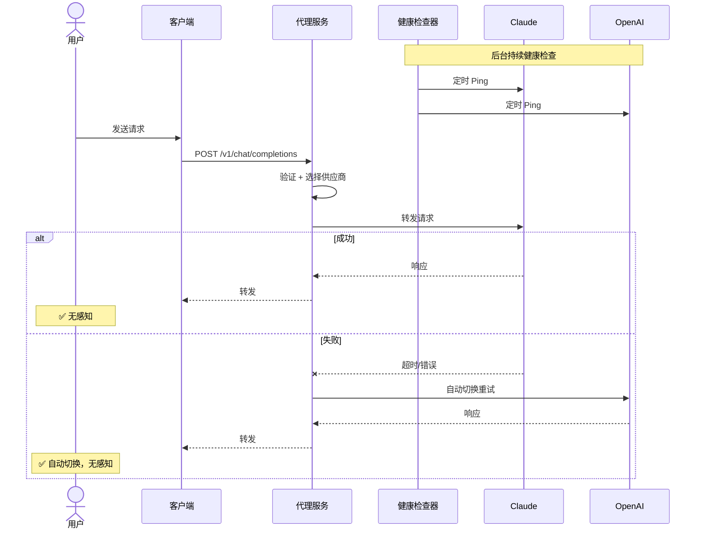
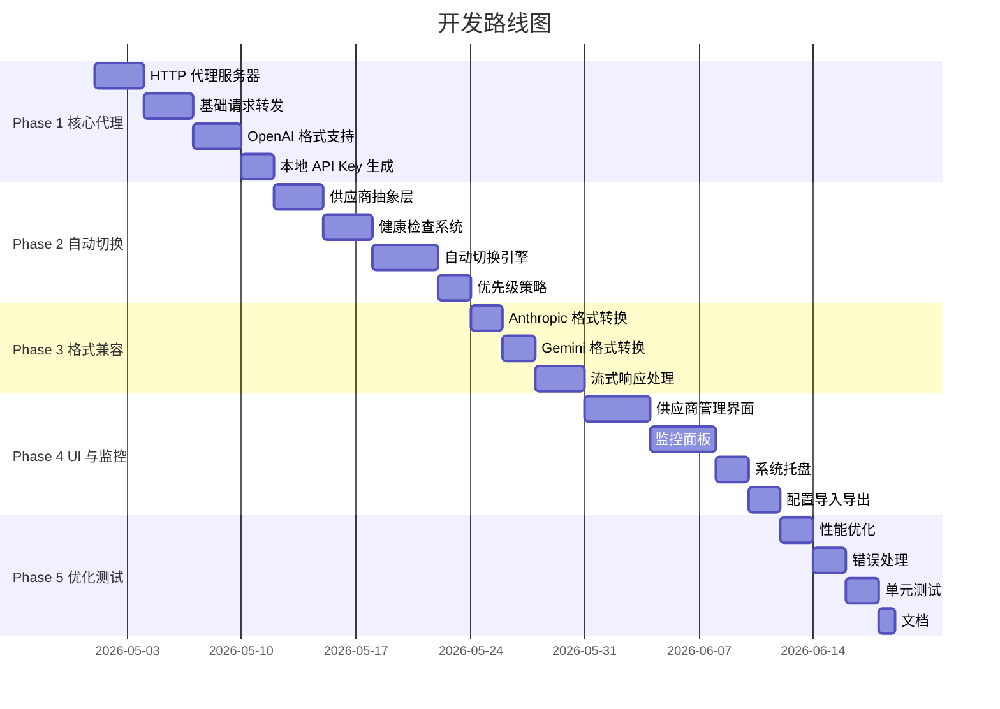

# CCUse 产品技术文档

> AI 服务供应商无感切换桌面应用 —— 一次配置，全局自动故障转移

---

## 一、产品概述

### 1.1 产品定位

**本地 API 代理 + 多供应商智能切换器**

CCUse 是一款桌面应用，在本地启动一个统一的 HTTP API 代理服务，将用户配置的多个 AI 服务供应商（Claude、OpenAI、Gemini、中转商、自定义端点）抽象为单一接口。任何支持自定义 API 的客户端（Claude Desktop、Cursor、Continue 等）只需指向本地代理，即可获得：

- 单次配置 → 全局生效
- 后台健康检查 + 自动故障转移
- 多种切换策略（优先级 / 智能 / 负载均衡）
- 实时监控与统计

### 1.2 核心价值

| 维度         | 价值                                                   |
| ------------ | ------------------------------------------------------ |
| **高可用**   | 自动检测供应商故障，秒级切换，避免服务中断             |
| **无感知**   | 用户/客户端无需任何感知或重启，切换全在代理层完成      |
| **统一管理** | 所有供应商集中配置、监控、计费分析                     |
| **成本优化** | 智能策略综合考虑速度、成本、可用性，自动选择最优供应商 |

### 1.3 目标用户

- 多供应商混用的 AI 应用开发者
- 对 AI 服务可用性敏感的企业团队
- 使用中转服务、需要降级备份的个人开发者
- 需要按成本/性能动态调度供应商的成本敏感用户

### 1.4 与传统方案对比

| 特性       | 传统手动切换        | CCUse              |
| ---------- | ------------------- | ------------------ |
| 切换方式   | 改配置 / 改环境变量 | 自动切换           |
| 客户端感知 | 需重启或重连        | 完全无感           |
| 配置复杂度 | 每个客户端单独配置  | 一次配置，全局生效 |
| 故障恢复   | 手动发现处理        | 自动检测 + 切换    |
| 监控能力   | 无                  | 实时面板           |

---

## 二、产品形态

### 2.1 形态总览



### 2.2 端到端架构



### 2.3 应用三层结构

```
桌面应用 (Tauri 2)
├── 前端 (React + TypeScript)
│   ├── 供应商管理面板
│   ├── 切换策略配置
│   ├── 实时监控仪表盘
│   └── 使用统计分析
└── 后端 (Rust)
    ├── HTTP 代理服务器（axum）
    ├── 供应商抽象层 + 格式转换
    ├── 健康检查器
    ├── 自动切换引擎
    └── 数据持久化（SQLite + 加密）
```

---

## 三、产品功能

### 3.1 功能 1：供应商配置

```
┌─────────────────────────────────────┐
│  供应商列表                         │
├─────────────────────────────────────┤
│  ✓ Claude (Anthropic)               │
│    API Key: sk-ant-xxxxx            │
│    优先级: 1                        │
│    状态: 🟢 健康                    │
│                                     │
│  ✓ OpenAI GPT-4                     │
│    API Key: sk-xxxxx                │
│    优先级: 2                        │
│    状态: 🟢 健康                    │
│                                     │
│  ✓ 中转服务 A                       │
│    API Key: sk-xxxxx                │
│    Base URL: https://api.xxx.com    │
│    优先级: 3                        │
│    状态: 🟡 降级                    │
│                                     │
│  [+ 添加供应商]                     │
└─────────────────────────────────────┘
```

支持类型：Claude / OpenAI / Gemini / 国内中转商 / 自定义端点。提供 API Key 加密存储、优先级、配额、限流配置。

### 3.2 功能 2：本地 API 服务

```
┌─────────────────────────────────────┐
│  本地 API 服务                      │
├─────────────────────────────────────┤
│  状态: 🟢 运行中                    │
│  端口: 8787                         │
│  OpenAI Base URL: http://localhost:8787/v1 │
│  OpenAI Key: sk-local-...           │
│                                     │
│  Anthropic Base URL: http://localhost:8787 │
│  Anthropic Key: sk-local-...        │
│  [复制] [重新生成全部 Key]          │
│                                     │
│  [停止服务] [重启服务]              │
└─────────────────────────────────────┘
```

应用启动后即拉起 HTTP 服务，分别生成 OpenAI-compatible 与 Anthropic 本地 API Key。用户按客户端协议复制对应的 `Base URL + Key`：OpenAI-compatible 客户端使用 `/v1` 结尾的 Base URL，Anthropic 客户端使用根 Base URL。

**已暴露端点**：`GET /v1/models`、`POST /v1/chat/completions`、`POST /v1/messages`、`POST /v1/responses`。其中 `/v1/responses` 是新一代 OpenAI Responses API（Codex CLI、最新版 OpenAI SDK 等使用），与 `/v1/chat/completions` 共享 OpenAI-compatible 协议组的本地 Key，支持自定义 function tool；内置工具（`web_search` / `file_search` / `code_interpreter` 等）在代理边界拒绝并返回 HTTP 400。`previous_response_id` / `store` / `text.format` / `reasoning` / `metadata` 字段静默忽略（无状态代理）。流式输出为 Responses 类型化 SSE 事件序列（`response.created` → `response.in_progress` → `response.output_item.added` → `response.content_part.added` → `response.output_text.delta`\* → `response.output_text.done` → `response.content_part.done` → `response.output_item.done` → `response.completed`，上游异常发 `error`）。响应 `model` 字段始终回显客户端请求的 `model`，避免账号池服务器改写 model 名时影响客户端对齐。

### 3.3 功能 3：切换策略配置

```
┌─────────────────────────────────────┐
│  切换策略                           │
├─────────────────────────────────────┤
│  ○ 优先级模式                       │
│     按优先级顺序尝试                │
│  ● 智能模式（推荐）                 │
│     综合考虑速度、成本、可用性      │
│  ○ 负载均衡                         │
│     分散请求到多个供应商            │
│                                     │
│  高级选项:                          │
│  ├─ 请求超时: 600 秒                │
│  ├─ 重试次数: 3 次                  │
│  ├─ 健康检查间隔: 60 秒             │
│  └─ 自动切换: ✓ 启用                │
└─────────────────────────────────────┘
```

**触发条件**：4xx/5xx 错误、超时、429 限流、配额耗尽、响应过慢、手动触发。

**切换策略**：

- **优先级**：按优先级顺序尝试
- **最快响应**：选择响应时间最短的可用供应商
- **成本优先**：选择单价最低的可用供应商
- **负载均衡**：在可用供应商间轮询/分发
- **智能模式**：综合速度、成本、可用性、优先级的加权评分

### 3.4 功能 4：实时监控

```
┌─────────────────────────────────────┐
│  实时监控                           │
├─────────────────────────────────────┤
│  当前使用: Claude (Anthropic)       │
│  今日请求: 1,234 次                 │
│  成功率: 99.2%                      │
│  平均响应: 1.2s                     │
│                                     │
│  供应商状态:                        │
│  Claude      🟢  234ms  100%        │
│  OpenAI      🟢  456ms  98.5%       │
│  中转服务A   🟡  1.2s   95.0%       │
│                                     │
│  最近切换:                          │
│  14:23 Claude → OpenAI（超时）      │
│  12:45 OpenAI → Claude（恢复）      │
└─────────────────────────────────────┘
```

包含实时状态卡片、24h 成功率与响应时间趋势图、成本饼图、切换事件时间线、桌面通知告警。

### 3.5 功能 5：配置管理与系统集成

- 配置导入/导出（JSON）
- 配置模板预设
- 系统托盘常驻：状态查看 / 复制 API Key / 重启服务 / 退出
- 桌面通知：故障告警、配额预警、切换提示

### 3.6 功能 6（扩展）：高级能力

- 基于时间 / 供应商规则的切换策略（白天 A、晚上 B；不同客户端走不同供应商）
- 配置云端同步、团队共享
- 对外暴露 REST API、Webhook、日志导出

---

## 四、技术架构

### 4.1 请求处理流程



### 4.2 模块划分

| 层级   | 模块                   | 职责                                                          |
| ------ | ---------------------- | ------------------------------------------------------------- |
| 接入层 | HTTP 服务（axum）      | 接收客户端请求、本地 Key 验证、流式响应转发                   |
| 转换层 | RequestConverter       | OpenAI / Anthropic / Gemini 格式互转，统一为 `UnifiedRequest` |
| 决策层 | SwitchEngine           | 按策略选供应商、失败重试、记录切换                            |
| 监控层 | HealthChecker          | 定时探活、维护健康状态缓存、推送状态变更事件                  |
| 数据层 | SQLite + SecureStorage | 配置/日志/历史持久化、API Key AES-256-GCM 加密                |
| UI 层  | React + Tauri Bridge   | 配置、监控、托盘菜单、桌面通知                                |

### 4.3 格式兼容设计



---

## 五、技术选型

### 5.1 前端

| 类别   | 选型                         | 理由                                                                                                                                                                                                          |
| ------ | ---------------------------- | ------------------------------------------------------------------------------------------------------------------------------------------------------------------------------------------------------------- |
| 框架   | React 18 + TypeScript        | 生态成熟、类型安全                                                                                                                                                                                            |
| 构建   | Vite                         | 启动快、HMR 友好                                                                                                                                                                                              |
| UI     | shadcn/ui + Radix UI         | 无样式注入、可定制                                                                                                                                                                                            |
| 样式   | **Tailwind CSS（唯一方案）** | 项目统一使用 Tailwind utility-first；不使用 CSS Modules / styled-components / Sass / 全局 CSS 文件；动态样式通过 `clsx` + `tailwind-merge` 组合；设计 token 集中维护在 `tailwind.config.ts` 的 `theme.extend` |
| 状态   | TanStack Query               | 适配 Tauri 事件流与异步命令                                                                                                                                                                                   |
| 图表   | Recharts                     | 监控面板趋势图、饼图                                                                                                                                                                                          |
| 编辑器 | CodeMirror 6                 | 配置 JSON 编辑                                                                                                                                                                                                |
| 国际化 | i18next                      | 中英文切换                                                                                                                                                                                                    |

### 5.2 后端

| 类别        | 选型               | 理由                                                              |
| ----------- | ------------------ | ----------------------------------------------------------------- |
| 语言        | Rust               | 性能、内存安全、原生跨平台                                        |
| 容器框架    | Tauri 2            | 轻量、安全、桌面原生能力，**同一份代码同时构建 Windows 与 macOS** |
| HTTP 服务   | axum               | 与 tokio 一致、人体工学好                                         |
| HTTP 客户端 | reqwest            | 流式、TLS、代理能力齐备                                           |
| 异步运行时  | tokio              | 标准选择，stream/timer 完整                                       |
| 序列化      | serde / serde_json | 统一序列化栈                                                      |
| 数据库      | SQLite (rusqlite)  | 嵌入式、零运维                                                    |
| 加密        | aes-gcm + ring     | API Key 加密存储                                                  |
| 日志        | tracing            | 结构化日志、可对接前端面板                                        |

### 5.3 目标平台与发布产物

每次发布**仅产出 3 个安装包**：

| 平台                       | 架构    | 产物文件       | 命名示例                        | WebView 运行时             | 签名                      |
| -------------------------- | ------- | -------------- | ------------------------------- | -------------------------- | ------------------------- |
| **macOS（Apple Silicon）** | aarch64 | `.dmg`         | `CCUse_<version>_aarch64.dmg`   | 系统自带 WKWebView         | Apple Developer ID + 公证 |
| **macOS（Intel）**         | x86_64  | `.dmg`         | `CCUse_<version>_x64.dmg`       | 系统自带 WKWebView         | Apple Developer ID + 公证 |
| **Windows**                | x86_64  | `.exe`（NSIS） | `CCUse_<version>_x64-setup.exe` | WebView2（自带 bootstrap） | EV / OV 代码签名          |

发布形态：

- 不打 universal 包（避免体积翻倍），mac 拆成 aarch64 / x86_64 两个独立 dmg
- 不输出 `.msi`，Windows 仅保留 NSIS `.exe` 安装器
- 同一份 React + Rust 源码，CI 矩阵在 `macos-latest`（构建 aarch64 与 x86_64 两个 target）与 `windows-latest` 上分别构建
- 平台差异（密钥环、托盘图标、自启动）抽象到统一接口，由 Tauri 平台适配层注入
  - 凭据存储：macOS Keychain / Windows Credential Manager
  - 托盘图标：mac 用模板图（自动适配深浅色菜单栏）；Windows 用彩色 ICO
  - 开机自启动：`tauri-plugin-autostart`（统一 API）
- 自动更新：`tauri-plugin-updater` + 签名校验；mac/win 同一发布渠道，按平台与架构匹配对应包

### 5.4 关键约束

- 仅监听 `127.0.0.1`，本地 API Key 防止其他用户进程滥用
- 默认端口 `8787`，被占用时自动从 `8787~8887` 探测可用端口
- 流式响应不中途切换，仅在请求开始前选择供应商
- **样式仅允许 Tailwind CSS**，禁止引入额外 CSS-in-JS 或全局样式文件

---

## 六、核心模块实现

### 6.1 HTTP 代理服务器

```rust
// src-tauri/src/proxy/server.rs
use axum::{Router, routing::{post, get}, extract::{State, Json}, http::{HeaderMap, StatusCode}};
use tokio::net::TcpListener;

pub struct ProxyServer {
    port: u16,
    switch_engine: Arc<SwitchEngine>,
    auth_key: String,
}

impl ProxyServer {
    pub async fn start(&self) -> Result<()> {
        let app = Router::new()
            .route("/v1/chat/completions", post(handle_chat_completion))
            .route("/v1/messages", post(handle_anthropic_messages))
            .route("/v1/responses", post(handle_responses_create))
            .route("/v1/models", get(handle_list_models))
            .with_state(self.switch_engine.clone());

        let listener = TcpListener::bind(format!("127.0.0.1:{}", self.port)).await?;
        axum::serve(listener, app).await?;
        Ok(())
    }
}

async fn handle_chat_completion(
    State(engine): State<Arc<SwitchEngine>>,
    headers: HeaderMap,
    Json(payload): Json<ChatCompletionRequest>,
) -> Result<Response, StatusCode> {
    let auth_key = extract_api_key(&headers)?;
    if !verify_local_key(&auth_key) {
        return Err(StatusCode::UNAUTHORIZED);
    }
    let response = engine.execute_request(payload).await?;
    Ok(response)
}
```

### 6.2 供应商抽象层

```rust
// src-tauri/src/provider/mod.rs
pub trait Provider: Send + Sync {
    async fn health_check(&self) -> Result<HealthStatus>;
    async fn send_request(&self, req: ApiRequest) -> Result<ApiResponse>;
    fn get_priority(&self) -> u8;
    fn get_cost_per_token(&self) -> f64;
    fn get_quota_remaining(&self) -> Option<u64>;
}

pub trait RequestConverter {
    fn to_provider_format(&self, req: &UnifiedRequest) -> ProviderRequest;
    fn from_provider_format(&self, resp: &ProviderResponse) -> UnifiedResponse;
}

pub struct UnifiedRequest {
    pub inbound_model: Option<String>,
    pub messages: Vec<Message>,
    pub temperature: Option<f32>,
    pub max_tokens: Option<u32>,
    pub stream: bool,
}
```

模型策略：客户端可以省略 `model`；客户端传入 `model` 时，代理优先保留该模型名并转发给 outbound provider，避免直连可用而代理改写模型导致命中错误账号池。仅当客户端省略 `model`，或上游明确返回模型不可用 / 不存在 / 无权限等模型选择错误时，Provider 才按默认候选链兜底。OpenAI-compatible 默认按 `gpt-5.5` → `gpt-5.4` → `gpt-5.4` 尝试，Anthropic 默认按 `claude-opus-4-7` → `claude-sonnet-4-6` → `claude-haiku-4-5-20251001` 尝试；Relay / Custom 会使用包含 GPT 与 Claude 的 OpenAI-compatible 默认候选链。入站 `model` 同时用于兼容解析、日志和客户端请求回放。

### 6.3 自动切换引擎

```rust
// src-tauri/src/services/switch_engine.rs
pub struct SwitchEngine {
    providers: Arc<RwLock<Vec<ProviderWrapper>>>,
    strategy: SwitchStrategy,
    health_checker: Arc<HealthChecker>,
    request_logger: Arc<RequestLogger>,
}

impl SwitchEngine {
    pub async fn execute_request(&self, req: UnifiedRequest) -> Result<UnifiedResponse> {
        let mut attempt = 0;
        let max_attempts = 3;

        while attempt < max_attempts {
            let provider = self.select_best_provider().await?;
            let provider_req = provider.converter.to_provider_format(&req);

            match provider.send_request(provider_req).await {
                Ok(resp) => {
                    self.record_success(&provider, &resp).await;
                    return Ok(provider.converter.from_provider_format(&resp));
                }
                Err(e) if e.is_retryable() => {
                    self.record_failure(&provider, &e).await;
                    self.mark_degraded(&provider).await;
                    self.log_switch(&provider, &e).await;
                    attempt += 1;
                    continue;
                }
                Err(e) => return Err(e),
            }
        }
        Err(Error::AllProvidersFailed)
    }

    async fn select_smart(&self, providers: &[&ProviderWrapper]) -> Option<ProviderWrapper> {
        let mut scores = Vec::new();
        for provider in providers {
            let health = self.health_checker.get_status(provider.id).await;
            let score =
                (1.0 / health.response_time as f64) * 0.4 +     // 响应速度 40%
                health.success_rate * 0.3 +                      // 成功率 30%
                (1.0 / provider.cost_per_token) * 0.2 +          // 成本 20%
                (provider.priority as f64 / 10.0) * 0.1;         // 优先级 10%
            scores.push((provider, score));
        }
        scores.sort_by(|a, b| b.1.partial_cmp(&a.1).unwrap());
        scores.first().map(|(p, _)| (*p).clone())
    }
}
```

### 6.4 健康检查器

```rust
// src-tauri/src/services/health_checker.rs
pub struct HealthChecker {
    check_interval: Duration,
    status_cache: Arc<RwLock<HashMap<String, HealthStatus>>>,
}

impl HealthChecker {
    pub async fn start(&self, providers: Arc<RwLock<Vec<ProviderWrapper>>>) {
        let mut interval = tokio::time::interval(self.check_interval);
        loop {
            interval.tick().await;
            for provider in providers.read().await.iter() {
                let status = self.check_provider(provider).await;
                self.status_cache.write().await.insert(provider.id.clone(), status.clone());
                self.emit_status_change(&provider.id, &status).await;
            }
        }
    }
}
```

### 6.5 流式响应转发

```rust
// src-tauri/src/proxy/stream.rs
use futures::stream::Stream;
use tokio_stream::StreamExt;

pub async fn proxy_stream(
    provider: &dyn Provider,
    request: ApiRequest,
) -> impl Stream<Item = Result<Bytes>> {
    let stream = provider.send_stream_request(request).await?;
    stream.map(|chunk| Ok(chunk))
}
```

### 6.6 本地 API Key 管理

```rust
// src-tauri/src/services/auth.rs
pub struct LocalAuth {
    openai_api_key: String,
    anthropic_api_key: String,
    created_at: DateTime<Utc>,
}

impl LocalAuth {
    pub fn generate_key() -> String {
        let random = generate_random_string(32);
        format!("sk-local-{}", random)
    }
    pub fn verify_openai_key(&self, key: &str) -> bool {
        constant_time_compare(key, &self.openai_api_key)
    }
    pub fn verify_anthropic_key(&self, key: &str) -> bool {
        constant_time_compare(key, &self.anthropic_api_key)
    }
}

#[tauri::command]
pub async fn get_local_api_config() -> Result<LocalApiConfig> {
    Ok(LocalApiConfig {
        base_url: "http://localhost:8787".to_string(),
        openai: LocalApiEndpointConfig {
            base_url: "http://localhost:8787/v1".to_string(),
            api_key: get_or_create_openai_local_key().await?,
        },
        anthropic: LocalApiEndpointConfig {
            base_url: "http://localhost:8787".to_string(),
            api_key: get_or_create_anthropic_local_key().await?,
        },
        port: 8787,
        status: get_server_status().await,
    })
}
```

### 6.7 系统托盘

```rust
// src-tauri/src/tray.rs
pub fn create_tray_menu() -> SystemTrayMenu {
    SystemTrayMenu::new()
        .add_item(CustomMenuItem::new("status", "状态: 运行中 🟢"))
        .add_item(CustomMenuItem::new("current", "当前: Claude"))
        .add_native_item(SystemTrayMenuItem::Separator)
        .add_item(CustomMenuItem::new("show", "显示主窗口"))
        .add_item(CustomMenuItem::new("copy_key", "复制 API Key"))
        .add_native_item(SystemTrayMenuItem::Separator)
        .add_item(CustomMenuItem::new("restart", "重启服务"))
        .add_item(CustomMenuItem::new("quit", "退出"))
}
```

---

## 七、数据库设计（SQLite）

```sql
-- 供应商配置
CREATE TABLE providers (
    id TEXT PRIMARY KEY,
    name TEXT NOT NULL,
    type TEXT NOT NULL,                  -- claude / openai / gemini / custom
    api_key TEXT NOT NULL,               -- 加密存储
    base_url TEXT NOT NULL,
    priority INTEGER DEFAULT 0,
    cost_per_1k_tokens REAL,
    enabled BOOLEAN DEFAULT 1,
    config_json TEXT,
    created_at INTEGER NOT NULL,
    updated_at INTEGER NOT NULL
);

-- 健康状态
CREATE TABLE health_status (
    provider_id TEXT PRIMARY KEY,
    status TEXT NOT NULL,                -- healthy / degraded / down
    last_check_at INTEGER NOT NULL,
    response_time_ms INTEGER,
    success_rate REAL,
    quota_remaining INTEGER,
    error_message TEXT,
    FOREIGN KEY (provider_id) REFERENCES providers(id)
);

-- 请求日志
CREATE TABLE request_logs (
    id INTEGER PRIMARY KEY AUTOINCREMENT,
    provider_id TEXT NOT NULL,
    request_type TEXT NOT NULL,
    status_code INTEGER,
    response_time_ms INTEGER,
    tokens_used INTEGER,
    cost REAL,
    success BOOLEAN,
    error_message TEXT,
    created_at INTEGER NOT NULL,
    FOREIGN KEY (provider_id) REFERENCES providers(id)
);

-- 切换历史
CREATE TABLE switch_history (
    id INTEGER PRIMARY KEY AUTOINCREMENT,
    from_provider_id TEXT,
    to_provider_id TEXT NOT NULL,
    reason TEXT NOT NULL,
    request_id TEXT,
    created_at INTEGER NOT NULL,
    FOREIGN KEY (from_provider_id) REFERENCES providers(id),
    FOREIGN KEY (to_provider_id) REFERENCES providers(id)
);

-- 应用配置
CREATE TABLE app_config (
    key TEXT PRIMARY KEY,
    value TEXT NOT NULL,
    updated_at INTEGER NOT NULL
);
```

---

## 八、安全性设计

### 8.1 API Key 加密存储

使用 AES-256-GCM 加密，主密钥派生自系统密钥环（macOS Keychain / Windows Credential Manager / Linux Secret Service）。

```rust
use aes_gcm::{Aes256Gcm, Key, Nonce};
use aes_gcm::aead::{Aead, NewAead};

pub struct SecureStorage { cipher: Aes256Gcm }

impl SecureStorage {
    pub fn encrypt_api_key(&self, key: &str) -> Result<Vec<u8>> { /* AES-256-GCM */ }
    pub fn decrypt_api_key(&self, encrypted: &[u8]) -> Result<String> { /* ... */ }
}
```

### 8.2 本地 API 防护

- 仅监听 `127.0.0.1`
- 本地 Key 长度 32 字节随机，常量时间比较防时序攻击
- 支持 Key 重新生成与失效

### 8.3 日志脱敏

- 请求/响应体在落库前脱敏（去除 API Key、个人信息）
- 默认不存请求/响应正文，仅存元数据

---

## 九、关键技术难点与方案

### 9.1 多 API 格式兼容

**方案**：统一中间格式 `UnifiedRequest`，每个供应商实现 `RequestConverter` 双向转换，新增供应商只需实现一个 trait。

模型字段处理：入站请求中的 `model` 可以省略；命中的 Provider 在出站前始终使用默认模型候选链补齐上游请求体，不依赖客户端模型名。响应中的实际模型以供应商返回为准。

### 9.2 流式响应切换

**问题**：SSE 流中途切换会破坏会话语义。
**方案**：仅在请求开始前选供应商；流中失败立即中止并返回错误，由客户端重试，重试时再重新选供应商。

### 9.3 端口占用

```rust
pub async fn find_available_port(start: u16) -> Result<u16> {
    for port in start..start+100 {
        if is_port_available(port).await { return Ok(port); }
    }
    Err(Error::NoAvailablePort)
}
```

### 9.4 并发请求

- `tokio` 异步处理，`Arc<RwLock<...>>` 保护共享状态
- 请求级限流（按客户端 / 按供应商）
- 通过 `User-Agent` 区分来源客户端

### 9.5 状态同步到前端

- Tauri 事件系统 `window.emit("provider-status-changed", payload)`
- 前端 TanStack Query 订阅事件并失效缓存
- WebSocket / 轮询作为备选

### 9.6 配额管理

- 抽象统一 `quota_remaining` 接口
- 定期查询 + 请求级估算消耗
- 接近阈值时主动降级到次要供应商

---

## 十、用户使用流程

### 10.1 初次配置



### 10.2 日常使用



---

## 十一、实施路线图



| 阶段              | 工期 | 关键交付                               |
| ----------------- | ---- | -------------------------------------- |
| Phase 1 核心代理  | 2 周 | HTTP 代理、OpenAI 格式、本地 Key       |
| Phase 2 自动切换  | 2 周 | 抽象层、健康检查、切换引擎、优先级策略 |
| Phase 3 格式兼容  | 1 周 | Anthropic / Gemini 转换、流式响应      |
| Phase 4 UI 与监控 | 2 周 | 供应商面板、监控、托盘、导入导出       |
| Phase 5 优化测试  | 1 周 | 性能、错误处理、测试、文档             |

---

## 十二、商业化规划

| 版本       | 限制                      | 功能                                |
| ---------- | ------------------------- | ----------------------------------- |
| **免费版** | 最多 3 个供应商，7 天日志 | 基础切换策略                        |
| **专业版** | 无限供应商、无限日志      | 全部策略、高级统计、优先支持        |
| **企业版** | 团队协作                  | 配置同步、对外 API、自定义策略、SLA |

---

## 十三、总结

CCUse 通过"**本地 API 代理 + 多供应商自动切换**"的产品形态，把多供应商容灾、调度、监控收敛到一个桌面应用中。客户端只需配置一次本地接口，所有切换逻辑由代理层透明承担，真正实现**用户无感、客户端无感**的供应商切换。

- **产品形态**：Tauri 桌面应用（配置/监控）+ 后台 HTTP 代理服务（请求转发与切换）
- **技术核心**：Rust + axum + tokio + SQLite + AES-256-GCM；React + Tauri 2 + shadcn/ui + Recharts
- **能力底座**：供应商抽象层、格式转换层、健康检查器、切换引擎、加密存储
- **可扩展方向**：策略插件化、云同步、对外 REST/Webhook、企业团队协作
