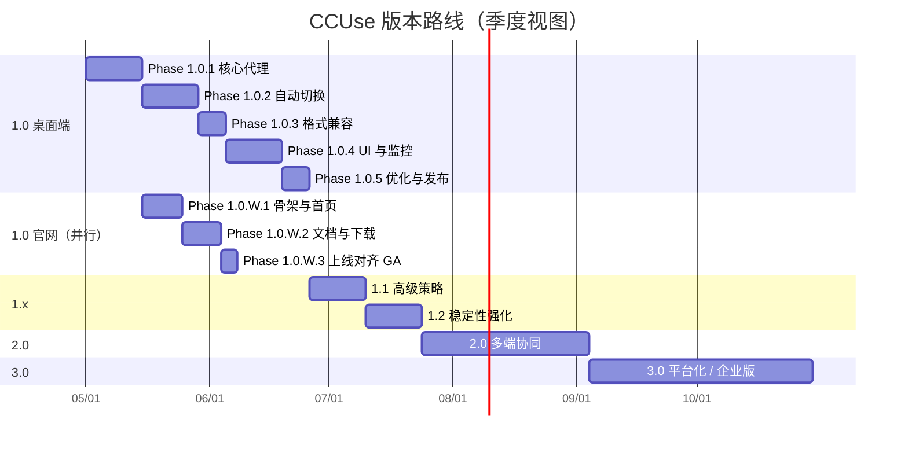

# CCUse 开发计划

> 从 1.0 MVP 到平台化的完整版本路线
> 与《产品技术文档.md》《.github/workflows/release.yml》对齐

---

## 目录

- [一、版本总览](#一版本总览)
- [二、1.0 详细计划（当前需求）](#二10-详细计划当前需求)
  - [Phase 1.0.1 核心代理（Week 1–2）](#phase-101-核心代理week-1-2)
  - [Phase 1.0.2 自动切换（Week 3–4）](#phase-102-自动切换week-3-4)
  - [Phase 1.0.3 格式兼容（Week 5）](#phase-103-格式兼容week-5)
  - [Phase 1.0.4 UI 与监控（Week 6–7）](#phase-104-ui-与监控week-6-7)
  - [Phase 1.0.5 优化、测试与发布（Week 8）](#phase-105-优化测试与发布week-8)
  - [Phase 1.0.W 官网（与桌面端并行）](#phase-10w-官网与桌面端并行)
- [三、1.x 体验迭代](#三1x-体验迭代)
- [四、2.0 多端 / 团队协同](#四20-多端团队协同)
- [五、3.0 企业版 / 平台化](#五30-企业版平台化)
- [六、跨阶段质量基线](#六跨阶段质量基线)

---

## 一、版本总览

> **当前版本：`0.0.0`（仓库仅有文档，尚未编码）**
> 1.0.0 是"全部 Phase 1.0.x 完成 + 通过验收"后的目标 GA 版本，**只能由 Phase 1.0.5 收尾时打出**。

### 1.0.0 之前的里程碑（每个 Phase 一个 minor）

| 阶段             | 起始版本 → 结束版本   | 性质           | 触发的 Release          |
| ---------------- | --------------------- | -------------- | ----------------------- |
| 起点             | — → `0.0.0`           | 初始化，仅文档 | 无                      |
| Phase 1.0.1 完成 | `0.0.0` → `0.1.0`     | pre-release    | `v0.1.0`（pre-release） |
| Phase 1.0.2 完成 | `0.1.0` → `0.2.0`     | pre-release    | `v0.2.0`（pre-release） |
| Phase 1.0.3 完成 | `0.2.0` → `0.3.0`     | pre-release    | `v0.3.0`（pre-release） |
| Phase 1.0.4 完成 | `0.3.0` → `0.4.0`     | pre-release    | `v0.4.0`（pre-release） |
| Phase 1.0.5 完成 | `0.4.0` → **`1.0.0`** | **GA 正式版**  | **`v1.0.0`**            |

每次 Phase 收尾把 `src-tauri/tauri.conf.json` 的 `version` 改为对应值，合 main 后由 `.github/workflows/release.yml` 自动打 tag、构建三平台产物、创建 GitHub Release。`0.x.y` 版本在 `tauri-action` 配置里标记 `prerelease: true`（仅 `1.0.0` 走正式 release，详见 §六）。

### 长期版本规划

| 版本      | 主题                                                 | 工期                                | 关键能力                                                                                                                 |
| --------- | ---------------------------------------------------- | ----------------------------------- | ------------------------------------------------------------------------------------------------------------------------ |
| **1.0.0** | **MVP：本地代理 + 自动切换 + 三平台发布 + 官网上线** | **8 周（2026-05-01 → 2026-06-26）** | 本地 HTTP 代理、3 类格式互转、健康检查、5 种切换策略、监控面板、托盘、Win/macOS 发布、Next.js 官网（首页 / 文档 / 下载） |
| 1.1.0     | 高级策略                                             | 2 周                                | 时间/模型/成本路由、预算告警                                                                                             |
| 1.2.0     | 稳定性强化                                           | 2 周                                | 自动更新、崩溃上报、性能基准、E2E 测试                                                                                   |
| 2.0.0     | 多端协同                                             | 6 周                                | 云端配置同步、团队共享、对外 REST API、Webhook、日志导出                                                                 |
| 3.0.0     | 平台化 / 企业版                                      | 8 周                                | 策略插件 SDK、SLA、Prometheus / OpenTelemetry、SSO、审计日志                                                             |



**版本边界规则**：

- `0.x.y` 阶段 **不承诺向前兼容**，配置 schema 可能在 Phase 之间发生破坏性调整
- `1.0.0` 完成《产品技术文档.md》§3.1–3.5 全部功能 + Win/macOS 三产物发布，**配置 schema 自此冻结**
- `1.x.y` 仅做增量、不破坏 `1.0.0` 配置兼容性
- `2.0.0` 引入云后端，本地优先模式仍可独立运行（云能力为可选叠加）
- `3.0.0` 提供 SDK / 插件机制，允许第三方策略接入

---

## 二、1.0 详细计划（当前需求）

> 范围：交付一个**单机可用**的桌面应用，覆盖配置、代理、自动切换、监控全链路，并以 GitHub Actions 自动产出 3 个安装包（mac aarch64 dmg / mac x64 dmg / win x64 exe）。
>
> **起始版本**：`0.0.0`（当前状态，无代码）→ 每完成一个 Phase 升一个 minor → Phase 1.0.5 收尾时升至 **`1.0.0`** GA。
>
> **节奏**：单 Sprint = 1 周，每周五 demo + 回顾。

### Phase 1.0.1 核心代理（Week 1–2）

**目标**：跑通"客户端 → 本地代理 → 单一供应商"链路；OpenAI 兼容路径可用。

**版本号变化**：`0.0.0` → `0.1.0`（pre-release）

**任务清单**（共 27 个，预计 10 人日）：

| ID                     | 任务                      | 说明                                                                                       | 工时  | 依赖                 |
| ---------------------- | ------------------------- | ------------------------------------------------------------------------------------------ | ----- | -------------------- |
| **A. 项目脚手架**      |                           |                                                                                            |       |                      |
| T1.0.1.01              | 初始化 Tauri 工程         | `pnpm create tauri-app`，React + TS 模板，目录约定 `src/` `src-tauri/`                     | 0.5d  | —                    |
| T1.0.1.02              | 接入 Tailwind + shadcn/ui | 配置 `tailwind.config.ts`、`globals.css` 入口；shadcn CLI 初始化；禁用其他 CSS 方案        | 0.5d  | T1.0.1.01            |
| T1.0.1.03              | Lint / 格式化工具链       | ESLint + Prettier + Husky + lint-staged + `cargo fmt --check` + `cargo clippy -D warnings` | 0.5d  | T1.0.1.01            |
| T1.0.1.04              | tauri.conf.json 基线      | `bundle.targets=["dmg","nsis"]`；`version=0.0.0`；窗口、产品名、CSP 占位                   | 0.25d | T1.0.1.01            |
| T1.0.1.05              | README 本地开发章节       | 安装依赖、`pnpm tauri dev`、调试技巧                                                       | 0.25d | T1.0.1.01            |
| **B. HTTP 代理服务**   |                           |                                                                                            |       |                      |
| T1.0.1.06              | axum 启动模板             | 监听 `127.0.0.1`，`tokio` runtime，graceful shutdown                                       | 0.5d  | T1.0.1.01            |
| T1.0.1.07              | 端口探测器                | 8787 起循环 100 个端口，找到可用即绑定，失败抛 `NoAvailablePort`                           | 0.25d | T1.0.1.06            |
| T1.0.1.08              | 路由骨架                  | `POST /v1/chat/completions` / `POST /v1/messages` / `GET /v1/models`（先返回 mock）        | 0.5d  | T1.0.1.06            |
| T1.0.1.09              | 统一错误中间件            | `Result<T, ApiError>` → JSON `{error: {code, message}}`，状态码映射                        | 0.5d  | T1.0.1.08            |
| T1.0.1.10              | CORS 中间件               | 仅放行 `127.0.0.1` 来源，预检请求处理                                                      | 0.25d | T1.0.1.08            |
| **C. 本地 API Key**    |                           |                                                                                            |       |                      |
| T1.0.1.11              | LocalAuth 生成器          | `sk-local-<32 chars>`（`rand::distributions::Alphanumeric`）                               | 0.25d | T1.0.1.06            |
| T1.0.1.12              | Tauri command             | `get_local_api_config` / `regenerate_api_key` / `restart_proxy`                            | 0.5d  | T1.0.1.11            |
| T1.0.1.13              | Key 校验中间件            | 同时识别 `Authorization: Bearer ...` 与 `x-api-key`，常量时间比较                          | 0.25d | T1.0.1.11            |
| **D. SQLite + 加密**   |                           |                                                                                            |       |                      |
| T1.0.1.14              | rusqlite 初始化           | WAL 模式、`PRAGMA foreign_keys=ON`、文件权限 0600                                          | 0.5d  | T1.0.1.01            |
| T1.0.1.15              | 迁移系统                  | `migrations/0001_init.sql`：`providers`、`app_config` 表                                   | 0.5d  | T1.0.1.14            |
| T1.0.1.16              | 主密钥（keyring-rs）      | 首启生成 256-bit 主密钥，存入系统钥匙环                                                    | 0.5d  | T1.0.1.14            |
| T1.0.1.17              | SecureStorage 封装        | AES-256-GCM 加解密 API Key；nonce 随机；MAC 校验                                           | 0.5d  | T1.0.1.16            |
| T1.0.1.18              | provider repository       | CRUD：`add / update / delete / list / get`（写入前自动加密）                               | 0.5d  | T1.0.1.15, T1.0.1.17 |
| **E. OpenAI Provider** |                           |                                                                                            |       |                      |
| T1.0.1.19              | Provider trait 草案       | `health_check / send_request / send_stream_request`；`ApiRequest/Response` 类型            | 0.5d  | T1.0.1.18            |
| T1.0.1.20              | OpenAIProvider 非流式     | reqwest POST，超时、重试 0 次（重试在切换层做）                                            | 0.5d  | T1.0.1.19            |
| T1.0.1.21              | OpenAIProvider 流式       | reqwest `bytes_stream`，逐块转发；处理 `data: [DONE]`                                      | 1d    | T1.0.1.20            |
| T1.0.1.22              | SSE 转发到客户端          | axum `Sse<Stream>`；保活 `keep-alive`                                                      | 0.5d  | T1.0.1.21            |
| **F. 最小前端**        |                           |                                                                                            |       |                      |
| T1.0.1.23              | 应用 Shell                | 侧边栏 + 顶栏 layout，路由 `/dashboard` `/providers` `/settings` 占位                      | 0.5d  | T1.0.1.02            |
| T1.0.1.24              | "本地 API 服务"卡片       | 状态徽标、Base URL、Key、复制按钮、重启按钮                                                | 0.5d  | T1.0.1.12, T1.0.1.23 |
| T1.0.1.25              | "添加供应商"表单          | OpenAI 模板：API Key + Base URL + 优先级；客户端校验                                       | 0.5d  | T1.0.1.18, T1.0.1.23 |
| T1.0.1.26              | Tauri 事件订阅            | 前端通过 `@tauri-apps/api/event` 监听服务状态广播                                          | 0.25d | T1.0.1.24            |
| T1.0.1.27              | demo 验证                 | Cursor 配置本地接口，录 GIF 放 README                                                      | 0.25d | T1.0.1.22, T1.0.1.25 |

**交付物**：

- 跑通 demo：Cursor 配置 `http://localhost:8787` + 本地 Key，发请求经代理到达 OpenAI 并正常返回
- README 增补"本地开发"章节
- 数据库表 `providers` / `app_config` 已落地
- `tauri.conf.json.version` 升至 `0.1.0`，合 main 触发 `v0.1.0` pre-release

**验收标准**：

- [ ] 启动应用 ≤ 2s，代理服务自动起停
- [ ] OpenAI 流式响应首字延迟 ≤ 200ms（不含网络）
- [ ] API Key 仅以密文形式落库，明文不出现在日志
- [ ] 错误的本地 Key 返回 401；正确 Key 透传成功
- [ ] GitHub Release `v0.1.0` 三平台产物可下载、可安装、可启动

**风险**：

- 系统钥匙环跨平台差异 → 用 `keyring-rs` 抹平；对接 macOS Keychain / Windows Credential Manager
- WebView2 在 Win10 旧版本可能未预装 → bundler 启用 `webviewInstallMode: downloadBootstrapper`

---

### Phase 1.0.2 自动切换（Week 3–4）

**目标**：多供应商配置 + 健康检查 + 优先级 / 智能策略下的失败自动切换。

**版本号变化**：`0.1.0` → `0.2.0`（pre-release）

**任务清单**（共 25 个，预计 10 人日）：

| ID                        | 任务                     | 说明                                                           | 工时  | 依赖      |
| ------------------------- | ------------------------ | -------------------------------------------------------------- | ----- | --------- |
| **A. 抽象层**             |                          |                                                                |       |           |
| T1.0.2.01                 | Provider trait 完整化    | 补全 `get_priority / get_cost_per_token / get_quota_remaining` | 0.25d | T1.0.1.19 |
| T1.0.2.02                 | ProviderWrapper          | 组合 config + converter + runtime_state（健康指标缓存）        | 0.5d  | T1.0.2.01 |
| T1.0.2.03                 | ProviderManager          | 全局注册表；启停；按 id 查找                                   | 0.5d  | T1.0.2.02 |
| **B. HealthChecker**      |                          |                                                                |       |           |
| T1.0.2.04                 | 周期任务循环             | `tokio::interval(check_interval)`；可热更新间隔                | 0.5d  | T1.0.2.03 |
| T1.0.2.05                 | 状态枚举 + 滑动窗口      | `Healthy/Degraded/Down`；`SlidingWindow<bool>` 算成功率        | 0.5d  | T1.0.2.04 |
| T1.0.2.06                 | 探活请求选择             | 优先 `GET /v1/models`；不支持时降级为低 token 补全             | 0.5d  | T1.0.2.04 |
| T1.0.2.07                 | 状态缓存                 | `Arc<RwLock<HashMap<ProviderId, HealthStatus>>>`               | 0.25d | T1.0.2.05 |
| T1.0.2.08                 | 状态变更事件             | Tauri `provider-status-changed` payload 含旧/新状态            | 0.25d | T1.0.2.07 |
| **C. 切换引擎（5 策略）** |                          |                                                                |       |           |
| T1.0.2.09                 | SwitchStrategy 枚举      | `Priority/Fastest/Cost/LoadBalance/Smart`；序列化              | 0.25d | T1.0.2.03 |
| T1.0.2.10                 | 优先级策略               | 在 healthy 中取 `min priority`                                 | 0.25d | T1.0.2.09 |
| T1.0.2.11                 | 最快响应策略             | 取 `min(rolling_response_time)`                                | 0.25d | T1.0.2.07 |
| T1.0.2.12                 | 成本优先策略             | 取 `min(cost_per_token)`；剔除 cost=null                       | 0.25d | T1.0.2.09 |
| T1.0.2.13                 | 负载均衡策略             | 加权 round-robin；权重 = 优先级倒数                            | 0.5d  | T1.0.2.09 |
| T1.0.2.14                 | 智能策略                 | 4 维加权评分（40/30/20/10），权重可配                          | 0.5d  | T1.0.2.07 |
| T1.0.2.15                 | 重试链 + degraded        | 失败标 degraded → 选下一个；3 次后返错                         | 0.75d | T1.0.2.10 |
| T1.0.2.16                 | 错误分类                 | `is_retryable`：408/429/5xx/超时=true；明确不重试 4xx          | 0.25d | T1.0.2.15 |
| **D. 切换 / 请求日志**    |                          |                                                                |       |           |
| T1.0.2.17                 | switch_history 表 + repo | 迁移 `0002_switch_history.sql`；写入路径                       | 0.5d  | T1.0.1.15 |
| T1.0.2.18                 | request_logs 表 + repo   | 迁移 `0003_request_logs.sql`；仅元数据，不存正文               | 0.5d  | T1.0.1.15 |
| **E. Tauri 命令**         |                          |                                                                |       |           |
| T1.0.2.19                 | provider CRUD 命令       | `list/add/update/delete_provider`                              | 0.5d  | T1.0.1.18 |
| T1.0.2.20                 | 策略命令                 | `set_strategy / get_strategy / update_strategy_params`         | 0.25d | T1.0.2.09 |
| T1.0.2.21                 | 健康快照命令             | `get_health_snapshot` 返回所有供应商当前健康摘要               | 0.25d | T1.0.2.07 |
| **F. 前端**               |                          |                                                                |       |           |
| T1.0.2.22                 | 多供应商列表 UI          | 状态灯 + 优先级 + 成本 + 启用开关                              | 0.75d | T1.0.2.19 |
| T1.0.2.23                 | 拖拽排序                 | `dnd-kit`，拖动后调用 update API 写入新优先级                  | 0.5d  | T1.0.2.22 |
| T1.0.2.24                 | 策略卡片                 | 5 种策略卡片 + 单选 + 文案说明                                 | 0.5d  | T1.0.2.20 |
| T1.0.2.25                 | 高级参数表单             | 超时 / 重试次数 / 健康检查间隔 / 智能权重滑块                  | 0.5d  | T1.0.2.20 |

**交付物**：

- 多供应商配置 UI（带优先级拖拽排序）
- 切换策略选择 UI（5 种 + 高级参数：超时 / 重试次数 / 健康检查间隔）
- demo：故意把第一个供应商 Key 改错，请求自动切换到第二个
- `tauri.conf.json.version` 升至 `0.2.0`，合 main 触发 `v0.2.0` pre-release

**验收标准**：

- [ ] 主供应商失败 → 切换 → 客户端在单个请求内完成（无需客户端重试）
- [ ] `switch_history` 完整记录每次切换原因
- [ ] 健康状态变化 ≤ 1s 内反映到 UI
- [ ] 智能模式评分稳定（同输入同输出，权重可调）
- [ ] GitHub Release `v0.2.0` 三平台产物可装可跑

**风险**：

- 流式响应中途切换会破坏会话语义 → 仅在请求**开始前**选供应商；流中失败立即返错由客户端重试
- 健康检查请求计费 → 用低成本模型 / `models` 端点替代真实补全

---

### Phase 1.0.3 格式兼容（Week 5）

**目标**：客户端可发送 OpenAI / Anthropic / Gemini 任一格式，后端可路由到任一供应商，正反向格式互转无损。

**版本号变化**：`0.2.0` → `0.3.0`（pre-release）

**任务清单**（共 14 个，预计 5 人日）：

| ID              | 任务                         | 说明                                                                    | 工时  | 依赖                            |
| --------------- | ---------------------------- | ----------------------------------------------------------------------- | ----- | ------------------------------- |
| **A. 中间格式** |                              |                                                                         |       |                                 |
| T1.0.3.01       | UnifiedRequest/Response      | 字段定稿；`#[serde(rename_all)]` 适配上下游                             | 0.5d  | T1.0.2.01                       |
| T1.0.3.02       | Message / Content / ToolCall | 子结构含多模态 content（text / image_url / tool_call）                  | 0.5d  | T1.0.3.01                       |
| **B. 转换器**   |                              |                                                                         |       |                                 |
| T1.0.3.03       | OpenAIConverter              | `messages` 直映射；`tools` 双向；usage 字段                             | 0.5d  | T1.0.3.02                       |
| T1.0.3.04       | AnthropicConverter           | `system` 抽出；`content` 数组化；`tool_use` ↔ `tool_calls`              | 0.75d | T1.0.3.02                       |
| T1.0.3.05       | GeminiConverter              | `contents/parts` 重组；`role: model` ↔ `assistant`；`functionCall` 映射 | 0.75d | T1.0.3.02                       |
| T1.0.3.06       | 工具调用闭环                 | 任意两两方向：定义→调用→结果回填                                        | 0.5d  | T1.0.3.03, T1.0.3.04, T1.0.3.05 |
| **C. SSE 互转** |                              |                                                                         |       |                                 |
| T1.0.3.07       | UnifiedStreamChunk           | `delta / finish_reason / usage`；序列化方案                             | 0.25d | T1.0.3.01                       |
| T1.0.3.08       | OpenAI SSE encoder           | `data: {choices:[{delta}]}\n\n`；`[DONE]` 终止                          | 0.25d | T1.0.3.07                       |
| T1.0.3.09       | Anthropic SSE encoder        | `event: message_start/content_block_delta/message_stop`                 | 0.5d  | T1.0.3.07                       |
| T1.0.3.10       | Gemini SSE encoder           | `data: {candidates:[{content:{parts}}]}`                                | 0.25d | T1.0.3.07                       |
| **D. 模型映射** |                              |                                                                         |       |                                 |
| T1.0.3.11       | 默认映射表                   | `gpt-4o` ↔ `claude-3-5-sonnet` ↔ `gemini-1.5-pro`；YAML 数据文件        | 0.25d | T1.0.3.01                       |
| T1.0.3.12       | 用户覆写 UI                  | 简易表格，本地存 `app_config.model_mapping`                             | 0.25d | T1.0.3.11                       |
| **E. 测试**     |                              |                                                                         |       |                                 |
| T1.0.3.13       | 转换器单元测试               | 覆盖率 ≥ 90%，含边界（空 messages / 长上下文 / 多 tool_calls）          | 0.75d | T1.0.3.06                       |
| T1.0.3.14       | 兼容性集成矩阵               | 3 客户端格式 × 3 供应商 = 9 条；非流式 + 流式各一                       | 0.75d | T1.0.3.10                       |

**交付物**：

- 三套转换器单元测试覆盖率 ≥ 90%
- 流式 SSE 端到端集成测试
- `tauri.conf.json.version` 升至 `0.3.0`，合 main 触发 `v0.3.0` pre-release

**验收标准**：

- [ ] Cursor（OpenAI 格式）→ 代理 → Anthropic Claude 输出正常
- [ ] Claude Desktop（Anthropic 格式）→ 代理 → OpenAI GPT 输出正常
- [ ] Tool calling 在三方向上都能往返
- [ ] 流式首字延迟相比直连 ≤ +50ms
- [ ] GitHub Release `v0.3.0` 三平台产物可装可跑

**风险**：

- 各家 API 演进不同步（如 `tool_choice` 字段语义差异）→ 转换器版本化，预留 unknown 字段透传

---

### Phase 1.0.4 UI 与监控（Week 6–7）

**目标**：完整可视化，达到产品技术文档 §3 全部 UI 形态。

**版本号变化**：`0.3.0` → `0.4.0`（pre-release）

**任务清单**（共 25 个，预计 10 人日）：

| ID                    | 任务                   | 说明                                                                         | 工时  | 依赖      |
| --------------------- | ---------------------- | ---------------------------------------------------------------------------- | ----- | --------- |
| **A. 供应商管理面板** |                        |                                                                              |       |           |
| T1.0.4.01             | 列表组件升级           | 行级状态指示 + 响应时间 + 成功率 + 启用开关                                  | 0.5d  | T1.0.2.22 |
| T1.0.4.02             | 编辑 / 删除            | 抽屉表单复用添加表单；删除二次确认                                           | 0.5d  | T1.0.4.01 |
| T1.0.4.03             | 5 类型添加表单         | Claude / OpenAI / Gemini / 中转 / 自定义；动态字段（自定义需 base_url）      | 0.75d | T1.0.4.01 |
| T1.0.4.04             | 配额 / 限流 / 成本字段 | 表单 + 校验 + 写库                                                           | 0.5d  | T1.0.4.03 |
| T1.0.4.05             | 测试连接按钮           | 调用对应 provider `health_check`，结果就地展示                               | 0.25d | T1.0.4.03 |
| **B. 切换策略页**     |                        |                                                                              |       |           |
| T1.0.4.06             | 5 策略卡片             | 大卡片 + 文案 + 推荐徽标（智能模式标 Recommended）                           | 0.5d  | T1.0.2.24 |
| T1.0.4.07             | 高级参数表单           | 超时 / 重试次数 / 健康检查间隔；带边界校验                                   | 0.5d  | T1.0.2.25 |
| T1.0.4.08             | 智能权重滑块           | 4 项滑块总和 = 100 联动；预览评分公式                                        | 0.5d  | T1.0.4.06 |
| **C. 监控仪表盘**     |                        |                                                                              |       |           |
| T1.0.4.09             | 实时状态卡片           | 当前供应商 / 今日请求 / 成功率 / 平均响应；订阅事件刷新                      | 0.5d  | T1.0.2.21 |
| T1.0.4.10             | 24h 成功率折线         | Recharts；时间桶 5min；hover tooltip                                         | 0.5d  | T1.0.4.14 |
| T1.0.4.11             | 响应时间折线           | 同上 + p50/p95 双线                                                          | 0.5d  | T1.0.4.14 |
| T1.0.4.12             | 成本饼图               | 按供应商；空数据态                                                           | 0.25d | T1.0.4.14 |
| T1.0.4.13             | 切换事件时间线         | 列表样式时间线，点击查看原因详情                                             | 0.5d  | T1.0.2.17 |
| T1.0.4.14             | 聚合查询命令           | SQL 时间桶聚合（CTE / `strftime`），加 `(provider_id, created_at DESC)` 索引 | 0.75d | T1.0.2.18 |
| **D. 系统托盘**       |                        |                                                                              |       |           |
| T1.0.4.15             | 托盘菜单               | 状态行 + 当前供应商行 + 显示 / 复制 Key / 重启 / 退出                        | 0.5d  | T1.0.1.12 |
| T1.0.4.16             | 跨平台图标资源         | mac 模板图（自动适配深浅）+ Win 彩色 ICO；构建期注入                         | 0.5d  | T1.0.4.15 |
| T1.0.4.17             | 桌面通知               | 故障 / 配额预警 / 切换；mac/win 实测；Win 需 manifest 声明                   | 0.5d  | T1.0.4.15 |
| **E. 配置导入导出**   |                        |                                                                              |       |           |
| T1.0.4.18             | JSON 序列化            | 导出当前配置（providers 去掉 ciphertext，改为口令重加密占位）                | 0.25d | T1.0.1.18 |
| T1.0.4.19             | 二次加密               | scrypt KDF 派生口令密钥 + AES-256-GCM；导入时反向                            | 0.5d  | T1.0.4.18 |
| T1.0.4.20             | 模板预设               | Claude / OpenAI / Gemini 一键导入（不含真实 Key，留空待填）                  | 0.25d | T1.0.4.03 |
| **F. 国际化**         |                        |                                                                              |       |           |
| T1.0.4.21             | i18next 集成           | namespace 划分（common / providers / strategy / monitor）                    | 0.25d | T1.0.1.23 |
| T1.0.4.22             | 中英双语 key 抽取      | 全量页面 key 化；Lint 规则禁止硬编码中文                                     | 0.75d | T1.0.4.21 |
| T1.0.4.23             | 语言切换               | 跟随系统 + 手动切换；持久化到 `app_config`                                   | 0.25d | T1.0.4.21 |
| **G. 验证**           |                        |                                                                              |       |           |
| T1.0.4.24             | 关闭主窗口最小化       | Tauri `close-requested` 事件拦截，最小化到托盘                               | 0.25d | T1.0.4.15 |
| T1.0.4.25             | UX 走查 + 验收         | §3 全部 UI 形态对齐，截图归档                                                | 0.25d | T1.0.4.\* |

**交付物**：

- 4 个主页面 + 托盘菜单
- 桌面通知在 mac/win 实测可见
- `tauri.conf.json.version` 升至 `0.4.0`，合 main 触发 `v0.4.0` pre-release

**验收标准**：

- [ ] 所有交互均在 ≤ 100ms 内有可感知反馈
- [ ] 关闭主窗口不退出应用（仅最小化到托盘）
- [ ] 配置导出文件二次打开需要口令
- [ ] 仅使用 Tailwind utility 编写样式，**无 `*.css` 模块文件**（除 `globals.css` Tailwind 入口外）
- [ ] GitHub Release `v0.4.0` 三平台产物可装可跑

**风险**：

- Tauri 通知 API 在 Win10 需声明 manifest → bundler 配置 `windows.notifications`
- 大量历史日志查询性能 → SQLite 加索引 `(provider_id, created_at DESC)`

---

### Phase 1.0.5 优化、测试与发布（Week 8）

**目标**：达到 1.0 GA 标准，三平台安装包公开发布。

**版本号变化**：`0.4.0` → **`1.0.0`**（GA 正式版，**首个非 pre-release**）

**任务清单**（共 22 个，预计 5 人日）：

| ID                    | 任务                   | 说明                                                            | 工时  | 依赖        |
| --------------------- | ---------------------- | --------------------------------------------------------------- | ----- | ----------- |
| **A. 性能**           |                        |                                                                 |       |             |
| T1.0.5.01             | 启动时间剖析           | 首屏 ≤ 1.5s；冷启动 trace；优化加载时机                         | 0.25d | —           |
| T1.0.5.02             | 内存基线               | 空闲 ≤ 150MB；查内存泄漏（heaptrack / Activity Monitor）        | 0.25d | —           |
| T1.0.5.03             | 代理 QPS 基准          | criterion 基准；单核 ≥ 200 RPS 透传                             | 0.5d  | T1.0.1.22   |
| **B. 错误路径稳定性** |                        |                                                                 |       |             |
| T1.0.5.04             | 端口冲突降级           | 100 个端口都占用时 UI 提示 + 重试                               | 0.25d | T1.0.1.07   |
| T1.0.5.05             | 钥匙环失败兜底         | macOS 锁屏 / Win 用户配置异常的 fallback                        | 0.25d | T1.0.1.16   |
| T1.0.5.06             | 数据库锁恢复           | `SQLITE_BUSY` 重试 + WAL checkpoint 调度                        | 0.25d | T1.0.1.14   |
| T1.0.5.07             | panic 兜底             | `catch_unwind` 包裹关键异步任务，崩溃前落盘日志                 | 0.25d | —           |
| **C. 测试矩阵**       |                        |                                                                 |       |             |
| T1.0.5.08             | 三家 API mock 集成测试 | wiremock；OpenAI / Anthropic / Gemini 各端点                    | 0.5d  | T1.0.3.\*   |
| T1.0.5.09             | 故障注入               | 429 / 5xx / 超时 / 半开连接；验证切换链路                       | 0.5d  | T1.0.5.08   |
| T1.0.5.10             | Playwright Tauri 冒烟  | 添加供应商 → 启动代理 → 发请求 → 看面板                         | 0.5d  | T1.0.4.\*   |
| **D. 安全**           |                        |                                                                 |       |             |
| T1.0.5.11             | 日志脱敏审计           | grep 检查 API Key / 请求体永不落日志                            | 0.25d | —           |
| T1.0.5.12             | Tauri CSP              | `default-src 'self'; connect-src 127.0.0.1`；移除 `unsafe-eval` | 0.25d | T1.0.1.04   |
| T1.0.5.13             | 依赖审计               | `cargo audit` + `pnpm audit --prod`；高危必修                   | 0.25d | —           |
| **E. 文档**           |                        |                                                                 |       |             |
| T1.0.5.14             | 用户手册中英           | 配置 / 切换策略 / 监控 / 导入导出；i18n 同步                    | 0.25d | T1.0.4.\*   |
| T1.0.5.15             | FAQ                    | 端口被占用 / WebView2 缺失 / 公证失败 / Win 误报                | 0.25d | —           |
| T1.0.5.16             | README 录屏与截图      | GIF 主流程 + 静态截图归档                                       | 0.25d | T1.0.4.25   |
| **F. 发布**           |                        |                                                                 |       |             |
| T1.0.5.17             | 版本号跳变             | `tauri.conf.json.version` 从 `0.4.0` → `1.0.0`（跳过 `0.5.0`）  | 0.1d  | —           |
| T1.0.5.18             | mac 公证 secrets 验证  | 在 GitHub Secrets 中配齐 6 个 APPLE\_\* 变量并跑一次试发        | 0.25d | release.yml |
| T1.0.5.19             | win 代码签名 secrets   | `WINDOWS_CERTIFICATE` / `WINDOWS_CERTIFICATE_PASSWORD` 试签     | 0.25d | release.yml |
| T1.0.5.20             | 触发自动发布           | 合 main，观察 Action：tag → 三平台构建 → Release                | 0.1d  | T1.0.5.17   |
| T1.0.5.21             | 干净系统冒烟           | 准备未装过 CCUse 的 mac/win 各一台，安装跑通核心流程            | 0.5d  | T1.0.5.20   |
| T1.0.5.22             | CHANGELOG `1.0.0`      | 整理本次发布的能力清单与 breaking changes（无）                 | 0.1d  | T1.0.5.20   |

**交付物**：

- GitHub Release `v1.0.0`，含 3 个签名安装包
- CHANGELOG `1.0.0` 节
- 用户手册站点（GitHub Pages 或 README）

**验收标准**：

- [ ] 三平台安装包能在干净系统上一键安装并跑通核心流程
- [ ] mac dmg 通过公证；Windows exe 已签名（如 secrets 配齐）
- [ ] 自动化 release pipeline 一次性绿灯
- [ ] 关键路径错误码有明确文案，不出现 panic

---

### Phase 1.0.W 官网（与桌面端并行）

> 与桌面端独立工作流，**Phase 1.0.4 起并行**，截止于桌面端 GA（与 `1.0.0` 同日上线）。
>
> **技术栈**：Next.js 14 App Router + Tailwind CSS（**唯一样式方案**）+ shadcn/ui（与桌面端共享设计 token）+ MDX（文档）+ Vercel 部署。
>
> **仓库结构**：升级为 pnpm workspaces monorepo
>
> ```
> apps/
>   desktop/      # 现 Tauri 应用（src + src-tauri）
>   website/      # 新增 Next.js 官网
> packages/
>   ui/           # 共享 shadcn 组件 + Tailwind preset
> ```

#### Phase 1.0.W.1 骨架与首页（Week 4–5，与桌面端 1.0.3–1.0.4 重叠）

**目标**：官网工程跑通，首页 + 基础布局上线 staging。

**任务清单**（共 12 个，预计 6 人日）：

| ID              | 任务                   | 说明                                                                    | 工时  | 依赖      |
| --------------- | ---------------------- | ----------------------------------------------------------------------- | ----- | --------- |
| **A. 工程化**   |                        |                                                                         |       |           |
| TW.1.01         | 仓库 monorepo 改造     | 引入 `pnpm-workspace.yaml`；移现有桌面代码到 `apps/desktop/`            | 0.5d  | T1.0.1.01 |
| TW.1.02         | Next.js 14 初始化      | App Router、Server Components、TypeScript、`apps/website/`              | 0.25d | TW.1.01   |
| TW.1.03         | Tailwind 接入          | `tailwind.config.ts` 共享 preset 抽到 `packages/ui/`                    | 0.5d  | TW.1.02   |
| TW.1.04         | shadcn 共享层          | `packages/ui/` 暴露 Button / Card / Dialog 等，桌面与官网共用           | 0.5d  | TW.1.03   |
| TW.1.05         | ESLint / Prettier 复用 | 桌面端配置抽到根；website 继承                                          | 0.25d | TW.1.01   |
| TW.1.06         | i18n 路由              | `next-intl`，路径 `/zh/*` `/en/*`；默认重定向到浏览器语言               | 0.5d  | TW.1.02   |
| **B. 全局布局** |                        |                                                                         |       |           |
| TW.1.07         | Header / Footer        | 品牌 logo + 导航（首页 / 功能 / 文档 / 下载）+ 语言切换 + GitHub 入口   | 0.5d  | TW.1.04   |
| TW.1.08         | 暗色模式               | `next-themes`；与桌面端一致的 token                                     | 0.25d | TW.1.04   |
| TW.1.09         | SEO 基线               | Metadata API、sitemap.xml、robots.txt、Open Graph 默认图                | 0.5d  | TW.1.07   |
| **C. 首页**     |                        |                                                                         |       |           |
| TW.1.10         | Hero 区                | 标题 / Slogan / 主 CTA（下载） / 副 CTA（GitHub）；动态产品截图         | 0.75d | TW.1.07   |
| TW.1.11         | 特性区块               | 6 张特性卡（无感切换 / 多供应商 / 健康检查 / 智能策略 / 监控 / 跨平台） | 0.5d  | TW.1.10   |
| TW.1.12         | 架构图区块             | 复用产品技术文档 mermaid 渲染，移动端图片回退                           | 0.5d  | TW.1.11   |

**交付物**：

- staging 环境（Vercel preview）首页可访问
- monorepo 结构落地，桌面端构建不受影响

**验收标准**：

- [ ] Lighthouse Performance ≥ 90、SEO ≥ 95
- [ ] 中英双语切换，浏览器语言自动识别
- [ ] 仅使用 Tailwind utility，**无 `*.css` / `*.module.css` 文件**（除全局入口外）
- [ ] 桌面端 `pnpm tauri dev` 在 monorepo 改造后仍可正常运行

---

#### Phase 1.0.W.2 文档与下载（Week 6–7，与桌面端 1.0.4 重叠）

**目标**：用户文档可读、下载页能拉到最新 Release 产物。

**任务清单**（共 14 个，预计 8 人日）：

| ID            | 任务                    | 说明                                                           | 工时  | 依赖        |
| ------------- | ----------------------- | -------------------------------------------------------------- | ----- | ----------- |
| **A. 文档站** |                         |                                                                |       |             |
| TW.2.01       | MDX 渲染管线            | `@next/mdx` + remark plugins + 代码高亮（shiki）               | 0.5d  | TW.1.02     |
| TW.2.02       | 文档左侧目录            | 自动从 `content/docs/**.mdx` 生成；可折叠                      | 0.5d  | TW.2.01     |
| TW.2.03       | 文档右侧 TOC            | 自动抽 `h2/h3`，滚动高亮                                       | 0.5d  | TW.2.02     |
| TW.2.04       | 全文搜索                | `pagefind`，构建期生成索引，纯静态                             | 0.5d  | TW.2.01     |
| TW.2.05       | 入门指南                | 安装 / 配置第一个供应商 / 接入 Cursor & Claude Desktop         | 0.75d | T1.0.4.\*   |
| TW.2.06       | 切换策略文档            | 5 种策略详解 + 何时选哪个                                      | 0.5d  | T1.0.4.06   |
| TW.2.07       | 监控与告警文档          | 仪表盘解读 / 切换历史查询                                      | 0.5d  | T1.0.4.13   |
| TW.2.08       | FAQ 与故障排查          | 端口被占 / WebView2 / 公证 / Win 误报                          | 0.5d  | T1.0.5.15   |
| **B. 功能页** |                         |                                                                |       |             |
| TW.2.09       | `/features` 长页面      | 每个功能配 3 张截图 + 说明；从首页特性卡跳入                   | 1d    | TW.1.11     |
| **C. 下载页** |                         |                                                                |       |             |
| TW.2.10       | GitHub Release API 拉取 | `app/download/page.tsx` ISR 60s；获取 latest release 产物列表  | 0.75d | release.yml |
| TW.2.11       | 平台自动识别            | UA 嗅探推荐对应包（mac aarch64 / mac intel / win）             | 0.5d  | TW.2.10     |
| TW.2.12       | 三产物下载卡            | 严格匹配命名 `*_aarch64.dmg` / `*_x64.dmg` / `*_x64-setup.exe` | 0.5d  | TW.2.10     |
| TW.2.13       | 校验 sha256 展示        | 从 release assets 读取（如 release.yml 输出 hash）             | 0.25d | TW.2.10     |
| TW.2.14       | Pre-release 分支        | 单独 `/download/preview` 展示 `0.x.y` pre-release，提示风险    | 0.25d | TW.2.10     |

**交付物**：

- `/docs` 完整用户手册（中英）
- `/download` 自动同步 GitHub 最新 Release
- staging 二审通过

**验收标准**：

- [ ] 文档全文搜索命中率 ≥ 主要关键词
- [ ] 下载页平均请求 ≤ 200ms（Vercel Edge Cache）
- [ ] mac/win UA 推荐包 100% 正确
- [ ] pre-release 与 stable 分流，不混在一起

---

#### Phase 1.0.W.3 上线对齐 GA（Week 8，与桌面端 1.0.5 重叠）

**目标**：与桌面端 `v1.0.0` 同日上线生产域名。

**任务清单**（共 8 个，预计 3 人日）：

| ID      | 任务              | 说明                                           | 工时  | 依赖      |
| ------- | ----------------- | ---------------------------------------------- | ----- | --------- |
| TW.3.01 | 生产域名接入      | 域名解析 / Vercel 绑定 / HTTPS / HSTS          | 0.25d | —         |
| TW.3.02 | Analytics         | Plausible / Vercel Analytics（不收集 PII）     | 0.25d | TW.3.01   |
| TW.3.03 | 站点性能复核      | Core Web Vitals 全绿；图片用 `next/image`      | 0.5d  | TW.1.\*   |
| TW.3.04 | 跨浏览器测试      | Chrome / Safari / Firefox / Edge；mac & win    | 0.25d | TW.3.01   |
| TW.3.05 | 移动端适配        | 320px–1920px；导航汉堡菜单                     | 0.5d  | TW.1.07   |
| TW.3.06 | 法律页            | 隐私政策 / 服务条款（使用模板生成）            | 0.5d  | —         |
| TW.3.07 | 与桌面 1.0.0 联调 | 桌面 `关于` 跳转官网；官网下载触发桌面 release | 0.25d | T1.0.5.20 |
| TW.3.08 | GA 上线发布       | DNS 切到生产；社媒首发；首日埋点观测           | 0.5d  | TW.3.07   |

**交付物**：

- 生产域名上线
- 与桌面端 `v1.0.0` 同日发布

**验收标准**：

- [ ] Lighthouse 全维度 ≥ 90
- [ ] 移动端可用，无横向滚动
- [ ] 隐私 / 服务条款齐备
- [ ] 与桌面端 1.0.0 互联（关于页跳转、下载页同步）

#### 官网部署 CI

新增 `.github/workflows/website.yml`（要点）：

- **触发**：push 到 main 且 `apps/website/**` 或 `packages/ui/**` 变更
- **构建**：`pnpm --filter website build`，产物推送 Vercel（用 `vercel --prod` 或 GitHub-Vercel 集成）
- **预览**：PR 触发 preview 部署（评论中给链接）
- **环境变量**：`GITHUB_TOKEN`（拉 Release API 限速更高）、`NEXT_PUBLIC_GITHUB_REPO`

---

## 三、1.x 体验迭代

### 1.1 高级策略（2 周）

| 任务                   | 说明                                                           |
| ---------------------- | -------------------------------------------------------------- |
| 时间窗路由             | 配置时段（如 9:00–18:00 用 A，其余用 B），cron 表达式校验      |
| 模型路由               | 按请求模型名匹配供应商（GPT-_ → OpenAI，claude-_ → Anthropic） |
| 成本预算               | 按月 / 日预算阈值，达到 80% 警告、100% 自动降级到低价供应商    |
| 配额预警               | 调用供应商配额 API（OpenAI usage / Anthropic limits）周期同步  |
| Webhook 通知（应用内） | 切换 / 故障 / 预算事件可投递到 Webhook（Slack / 飞书）         |

**验收**：策略组合可叠加、规则有冲突时按优先级解析；新增策略不破坏 1.0 配置结构。

### 1.2 稳定性强化（2 周）

| 任务         | 说明                                                       |
| ------------ | ---------------------------------------------------------- |
| 自动更新     | `tauri-plugin-updater`；mac/win 同一发布渠道；签名校验必选 |
| 崩溃上报     | Sentry（Rust + JS），用户可关闭，默认开启                  |
| 性能回归     | Criterion 基准 + CI 阈值                                   |
| E2E 矩阵扩展 | 三平台 GitHub Runner 自动跑 Playwright Tauri               |
| 日志归档     | 滚动日志（按天 + 体积），导出 zip                          |

**验收**：自动更新成功率 ≥ 99%，崩溃率 < 0.1%。

---

## 四、2.0 多端 / 团队协同

> 主题：从单机工具迈向"多端 + 团队"。引入云后端，但单机模式仍完整可用。

**工期**：6 周

**子模块**：

1. **云端配置同步（2 周）**
   - 后端：Cloudflare Workers + D1（或 Supabase），用户登录（GitHub OAuth）
   - 端到端加密：客户端用用户口令派生密钥，云仅存密文
   - 多端冲突解决：CRDT 或 last-write-wins + 历史版本
2. **团队共享（2 周）**
   - 团队空间，成员角色（owner / admin / member）
   - 共享供应商池（API Key 不下发，仅签发短期代理 token）
   - 团队内审计日志
3. **对外 REST API + Webhook（1 周）**
   - 应用启动时可暴露 REST API（默认本机，可白名单）
   - 事件 Webhook：供应商状态变化、切换、预算
4. **日志导出（1 周）**
   - JSON / CSV 导出
   - 可对接 ELK / Loki

**验收**：

- 团队 10 人协同配置 1 小时内同步完成
- 离线状态下应用功能不受影响

---

## 五、3.0 企业版 / 平台化

> 主题：开放平台 + 企业级特性。

**工期**：8 周

**子模块**：

1. **策略插件 SDK（3 周）**
   - WebAssembly 插件运行时（`wasmtime`）
   - 插件 API：注册策略、订阅事件、读取健康指标
   - 插件市场（社区贡献）
2. **可观测性（2 周）**
   - Prometheus exporter
   - OpenTelemetry trace 透传
   - Grafana dashboard 模板
3. **企业认证与审计（2 周）**
   - SSO（OIDC / SAML）
   - 操作审计日志（不可篡改 + 导出）
   - 数据保留策略
4. **SLA 保障（1 周）**
   - 多区域代理（用户自托管节点编排）
   - 故障演练工具

**验收**：

- 第三方插件可发布到市场并被用户一键安装
- Prometheus 指标接入企业监控系统

---

## 六、跨阶段质量基线

适用于所有版本，每个 Sprint 末检视：

| 维度     | 基线                                                                                                                                                                                    |
| -------- | --------------------------------------------------------------------------------------------------------------------------------------------------------------------------------------- |
| 测试覆盖 | 核心模块（converter / switch_engine / health_checker）≥ 85%                                                                                                                             |
| Lint     | `cargo clippy -- -D warnings`、`pnpm lint` 全绿                                                                                                                                         |
| 类型     | `tsc --noEmit` 全绿；Rust 不允许 `unwrap()` 进入主路径                                                                                                                                  |
| 安全     | API Key 不进日志；CI 跑 `cargo audit` + `pnpm audit --prod`                                                                                                                             |
| 样式     | 仅 Tailwind；新增 CSS 文件需架构评审                                                                                                                                                    |
| Commit   | Conventional Commits；release tag 由 GitHub Actions 自动生成                                                                                                                            |
| 发布产物 | 严格 3 个：`*_aarch64.dmg` / `*_x64.dmg` / `*_x64-setup.exe`                                                                                                                            |
| 版本号   | 起点 `0.0.0`；每个 Phase 收尾升 minor 触发 pre-release；唯一 `1.0.0` 是 Phase 1.0.5 GA。`v0.x.y` 必须 `prerelease: true`，`v1.0.0+` 才走正式 release                                    |
| 官网     | Next.js 14 + Tailwind（唯一样式）+ shadcn 共享层；与桌面端在同一 monorepo（`apps/desktop` + `apps/website` + `packages/ui`）；Vercel 部署；`/download` 通过 GitHub Release API 自动同步 |
| 文档     | 用户可见行为变化必须更新 README + CHANGELOG                                                                                                                                             |

---

## 附：1.0 任务总览（可作为 GitHub Project 看板初始化）

```
Phase 1.0.1 核心代理
  - [ ] 脚手架：Tauri 2 + React + Tailwind + shadcn
  - [ ] axum 代理服务 + 端口探测
  - [ ] 本地 API Key 生成与校验
  - [ ] SQLite + AES-256-GCM 加密
  - [ ] OpenAI Provider 流式 / 非流式打通
  - [ ] 最小前端：本地 API 卡 + 添加供应商表单

Phase 1.0.2 自动切换
  - [ ] Provider trait + ProviderManager
  - [ ] HealthChecker（周期探活、状态缓存、事件推送）
  - [ ] SwitchEngine 5 种策略
  - [ ] 重试链 + 切换日志
  - [ ] 拖拽排序 UI、策略配置 UI

Phase 1.0.3 格式兼容
  - [ ] UnifiedRequest / UnifiedResponse 设计
  - [ ] OpenAI / Anthropic / Gemini 三套转换器
  - [ ] 流式 SSE 互转
  - [ ] 模型映射表 UI

Phase 1.0.4 UI 与监控
  - [ ] Recharts 实时仪表盘
  - [ ] 系统托盘 + 桌面通知
  - [ ] 配置导入导出 + 模板预设
  - [ ] i18n 中英双语

Phase 1.0.5 优化、测试与发布
  - [ ] 单元 / 集成 / E2E 测试
  - [ ] 性能基准
  - [ ] 安全审计
  - [ ] 文档与 FAQ
  - [ ] tauri.conf.json version → 1.0.0
  - [ ] 合 main 触发 GitHub Actions 发布

Phase 1.0.W 官网（并行）
  W.1 骨架与首页
  - [ ] monorepo（pnpm workspaces）
  - [ ] Next.js 14 + Tailwind + shadcn 共享层
  - [ ] i18n 中英 / 暗色模式 / SEO 基线
  - [ ] Hero + 特性区 + 架构图区
  W.2 文档与下载
  - [ ] MDX 文档站 + 全文搜索
  - [ ] 入门指南 / 策略文档 / FAQ
  - [ ] /download 自动同步 GitHub Release
  - [ ] Pre-release 与 stable 分流
  W.3 上线对齐 GA
  - [ ] 生产域名 / Analytics
  - [ ] 移动端适配 + Lighthouse ≥ 90
  - [ ] 法律页 / 与桌面 1.0.0 互联
```
