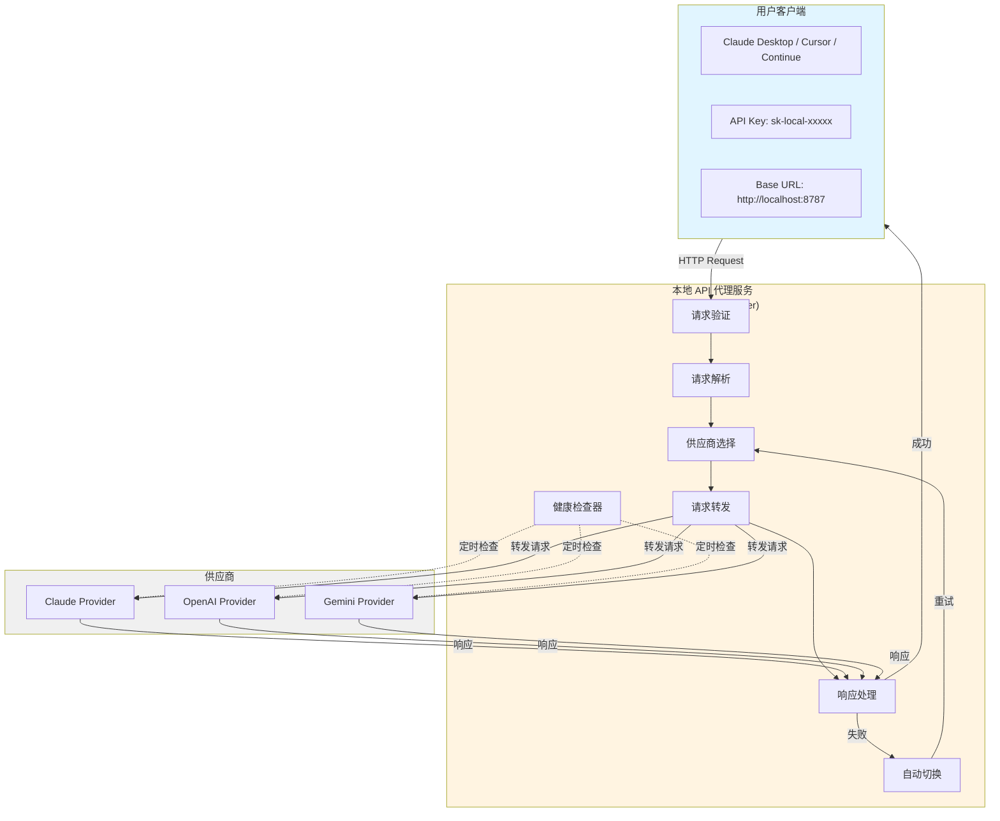
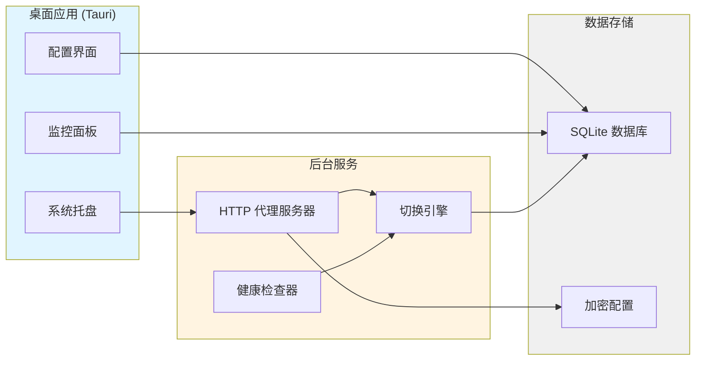
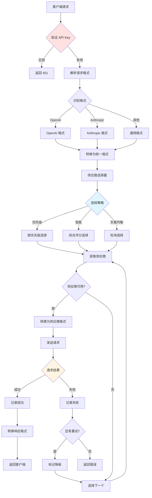
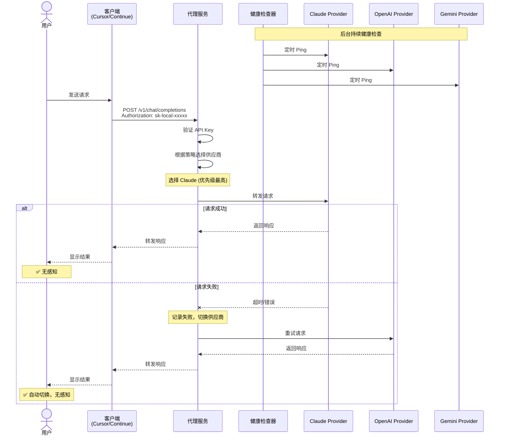
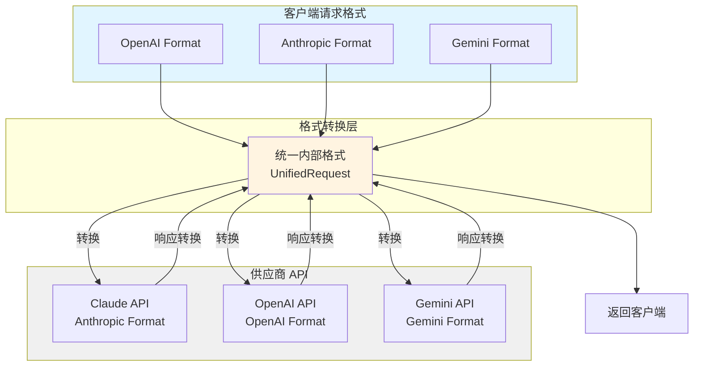
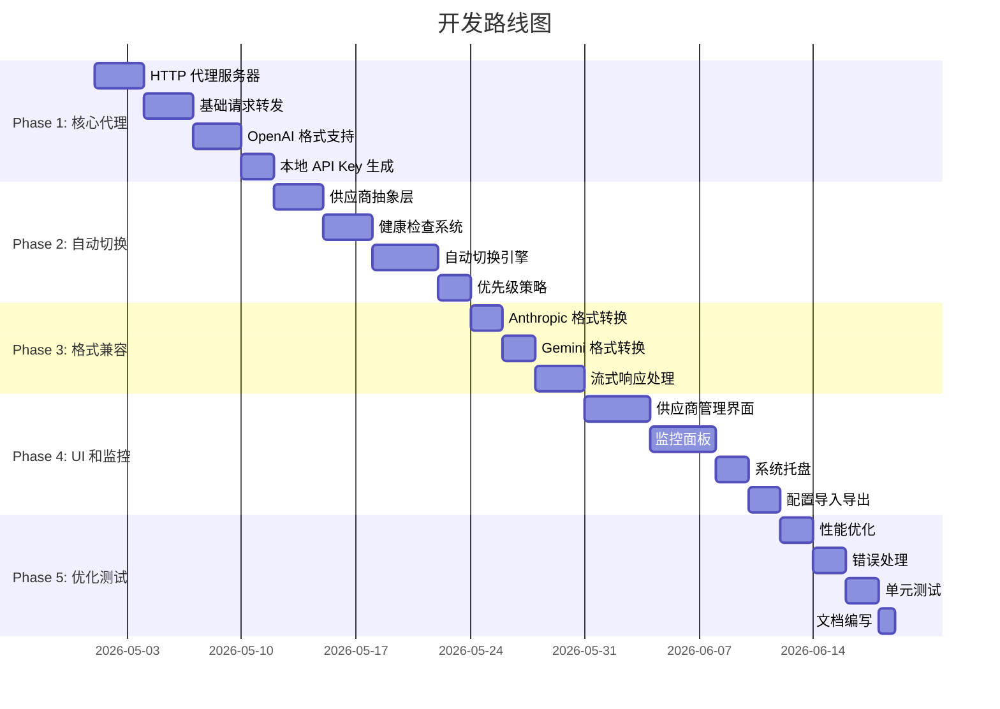

# 无感切换方案 - API 代理模式

## 一、核心理念

用户在应用中配置多个供应商 → 应用启动本地 API 代理服务 → 生成统一的 API Key 和 Base URL → 用户在任何客户端使用这个统一接口 → 后台自动切换供应商，用户完全无感知

## 二、架构设计



## 三、产品形态重新定义

### 3.1 应用定位

**本地 API 代理 + 供应商管理器**



### 3.2 核心功能

#### 功能 1：供应商配置

```
┌─────────────────────────────────────┐
│  供应商列表                          │
├─────────────────────────────────────┤
│  ✓ Claude (Anthropic)               │
│    API Key: sk-ant-xxxxx            │
│    优先级: 1                         │
│    状态: 🟢 健康                     │
│                                      │
│  ✓ OpenAI GPT-4                     │
│    API Key: sk-xxxxx                │
│    优先级: 2                         │
│    状态: 🟢 健康                     │
│                                      │
│  ✓ 中转服务 A                        │
│    API Key: sk-xxxxx                │
│    Base URL: https://api.xxx.com    │
│    优先级: 3                         │
│    状态: 🟡 降级                     │
│                                      │
│  [+ 添加供应商]                      │
└─────────────────────────────────────┘
```

#### 功能 2：本地 API 服务

```
┌─────────────────────────────────────┐
│  本地 API 服务                       │
├─────────────────────────────────────┤
│  状态: 🟢 运行中                     │
│  端口: 8787                          │
│  Base URL: http://localhost:8787    │
│                                      │
│  API Key: sk-local-abc123def456     │
│  [复制] [重新生成]                   │
│                                      │
│  [停止服务] [重启服务]               │
└─────────────────────────────────────┘
```

#### 功能 3：切换策略配置

```
┌─────────────────────────────────────┐
│  切换策略                            │
├─────────────────────────────────────┤
│  ○ 优先级模式                        │
│     按优先级顺序尝试                 │
│                                      │
│  ● 智能模式 (推荐)                   │
│     综合考虑速度、成本、可用性       │
│                                      │
│  ○ 负载均衡                          │
│     分散请求到多个供应商             │
│                                      │
│  高级选项:                           │
│  ├─ 请求超时: 30 秒                  │
│  ├─ 重试次数: 3 次                   │
│  ├─ 健康检查间隔: 60 秒              │
│  └─ 自动切换: ✓ 启用                 │
└─────────────────────────────────────┘
```

#### 功能 4：实时监控

```
┌─────────────────────────────────────┐
│  实时监控                            │
├─────────────────────────────────────┤
│  当前使用: Claude (Anthropic)        │
│  今日请求: 1,234 次                  │
│  成功率: 99.2%                       │
│  平均响应: 1.2s                      │
│                                      │
│  供应商状态:                         │
│  Claude      🟢  234ms  100%        │
│  OpenAI      🟢  456ms  98.5%       │
│  中转服务A   🟡  1.2s   95.0%        │
│                                      │
│  最近切换:                           │
│  14:23 Claude → OpenAI (超时)       │
│  12:45 OpenAI → Claude (恢复)       │
└─────────────────────────────────────┘
```

## 四、技术实现方案

### 4.1 本地 API 代理服务架构



### 4.1.1 HTTP 服务器

```rust
// src-tauri/src/proxy/server.rs
use axum::{
    Router,
    routing::post,
    extract::{State, Json},
    http::{HeaderMap, StatusCode},
};
use tokio::net::TcpListener;

pub struct ProxyServer {
    port: u16,
    switch_engine: Arc<SwitchEngine>,
    auth_key: String,
}

impl ProxyServer {
    pub async fn start(&self) -> Result<()> {
        let app = Router::new()
            .route("/v1/chat/completions", post(handle_chat_completion))
            .route("/v1/messages", post(handle_anthropic_messages))
            .route("/v1/models", get(handle_list_models))
            .with_state(self.switch_engine.clone());

        let listener = TcpListener::bind(format!("127.0.0.1:{}", self.port)).await?;
        axum::serve(listener, app).await?;
        Ok(())
    }
}

async fn handle_chat_completion(
    State(engine): State<Arc<SwitchEngine>>,
    headers: HeaderMap,
    Json(payload): Json<ChatCompletionRequest>,
) -> Result<Response, StatusCode> {
    // 1. 验证 API Key
    let auth_key = extract_api_key(&headers)?;
    if !verify_local_key(&auth_key) {
        return Err(StatusCode::UNAUTHORIZED);
    }

    // 2. 执行请求（自动切换）
    let response = engine.execute_request(payload).await?;

    // 3. 返回响应（支持流式）
    Ok(response)
}
```

#### 4.1.2 请求格式转换

```rust
// src-tauri/src/proxy/converter.rs
pub trait RequestConverter {
    fn to_provider_format(&self, req: &UnifiedRequest) -> ProviderRequest;
    fn from_provider_format(&self, resp: &ProviderResponse) -> UnifiedResponse;
}

// OpenAI 格式转换器
pub struct OpenAIConverter;
impl RequestConverter for OpenAIConverter {
    fn to_provider_format(&self, req: &UnifiedRequest) -> ProviderRequest {
        // 转换为 OpenAI API 格式
    }
}

// Anthropic 格式转换器
pub struct AnthropicConverter;
impl RequestConverter for AnthropicConverter {
    fn to_provider_format(&self, req: &UnifiedRequest) -> ProviderRequest {
        // 转换为 Anthropic API 格式
    }
}
```

#### 4.1.3 流式响应处理

```rust
// src-tauri/src/proxy/stream.rs
use futures::stream::Stream;
use tokio_stream::StreamExt;

pub async fn proxy_stream(
    provider: &dyn Provider,
    request: ApiRequest,
) -> impl Stream<Item = Result<Bytes>> {
    let stream = provider.send_stream_request(request).await?;

    stream.map(|chunk| {
        // 转换为统一格式
        // 处理错误
        // 记录日志
        Ok(chunk)
    })
}
```

### 4.2 自动切换引擎（增强版）

```rust
// src-tauri/src/services/switch_engine.rs
pub struct SwitchEngine {
    providers: Arc<RwLock<Vec<ProviderWrapper>>>,
    strategy: SwitchStrategy,
    health_checker: Arc<HealthChecker>,
    request_logger: Arc<RequestLogger>,
}

impl SwitchEngine {
    pub async fn execute_request(&self, req: UnifiedRequest) -> Result<UnifiedResponse> {
        let mut attempt = 0;
        let max_attempts = 3;

        while attempt < max_attempts {
            // 1. 选择供应商
            let provider = self.select_best_provider().await?;

            // 2. 转换请求格式
            let provider_req = provider.converter.to_provider_format(&req);

            // 3. 发送请求
            match provider.send_request(provider_req).await {
                Ok(resp) => {
                    // 记录成功
                    self.record_success(&provider, &resp).await;
                    return Ok(provider.converter.from_provider_format(&resp));
                }
                Err(e) if e.is_retryable() => {
                    // 记录失败
                    self.record_failure(&provider, &e).await;

                    // 标记供应商降级
                    self.mark_degraded(&provider).await;

                    // 记录切换
                    self.log_switch(&provider, &e).await;

                    attempt += 1;
                    continue;
                }
                Err(e) => return Err(e),
            }
        }

        Err(Error::AllProvidersFailed)
    }

    async fn select_best_provider(&self) -> Result<ProviderWrapper> {
        let providers = self.providers.read().await;
        let healthy = providers.iter()
            .filter(|p| p.is_healthy())
            .collect::<Vec<_>>();

        if healthy.is_empty() {
            return Err(Error::NoHealthyProvider);
        }

        match self.strategy {
            SwitchStrategy::Priority => {
                healthy.iter()
                    .min_by_key(|p| p.priority)
                    .cloned()
            }
            SwitchStrategy::Smart => {
                self.select_smart(&healthy).await
            }
            // ... 其他策略
        }
    }

    async fn select_smart(&self, providers: &[&ProviderWrapper]) -> Option<ProviderWrapper> {
        // 综合评分算法
        let mut scores = Vec::new();

        for provider in providers {
            let health = self.health_checker.get_status(provider.id).await;

            let score =
                (1.0 / health.response_time as f64) * 0.4 +  // 响应速度权重 40%
                health.success_rate * 0.3 +                   // 成功率权重 30%
                (1.0 / provider.cost_per_token) * 0.2 +       // 成本权重 20%
                (provider.priority as f64 / 10.0) * 0.1;      // 优先级权重 10%

            scores.push((provider, score));
        }

        scores.sort_by(|a, b| b.1.partial_cmp(&a.1).unwrap());
        scores.first().map(|(p, _)| (*p).clone())
    }
}
```

### 4.3 健康检查系统

```rust
// src-tauri/src/services/health_checker.rs
pub struct HealthChecker {
    check_interval: Duration,
    status_cache: Arc<RwLock<HashMap<String, HealthStatus>>>,
}

impl HealthChecker {
    pub async fn start(&self, providers: Arc<RwLock<Vec<ProviderWrapper>>>) {
        let mut interval = tokio::time::interval(self.check_interval);

        loop {
            interval.tick().await;

            let providers = providers.read().await;
            for provider in providers.iter() {
                let status = self.check_provider(provider).await;

                // 更新缓存
                self.status_cache.write().await.insert(
                    provider.id.clone(),
                    status.clone(),
                );

                // 触发前端事件
                self.emit_status_change(&provider.id, &status).await;
            }
        }
    }

    async fn check_provider(&self, provider: &ProviderWrapper) -> HealthStatus {
        let start = Instant::now();

        // 发送测试请求
        let result = provider.health_check().await;

        let response_time = start.elapsed().as_millis() as u32;

        match result {
            Ok(_) => HealthStatus {
                status: Status::Healthy,
                response_time,
                last_check: Utc::now(),
                error: None,
            },
            Err(e) => HealthStatus {
                status: Status::Down,
                response_time,
                last_check: Utc::now(),
                error: Some(e.to_string()),
            },
        }
    }
}
```

### 4.4 本地 API Key 管理

```rust
// src-tauri/src/services/auth.rs
pub struct LocalAuth {
    api_key: String,
    created_at: DateTime<Utc>,
}

impl LocalAuth {
    pub fn generate_key() -> String {
        // 生成格式: sk-local-{random_32_chars}
        let random = generate_random_string(32);
        format!("sk-local-{}", random)
    }

    pub fn verify_key(&self, key: &str) -> bool {
        // 常量时间比较，防止时序攻击
        constant_time_compare(key, &self.api_key)
    }
}

#[tauri::command]
pub async fn get_local_api_config() -> Result<LocalApiConfig> {
    Ok(LocalApiConfig {
        base_url: "http://localhost:8787".to_string(),
        api_key: get_or_create_local_key().await?,
        port: 8787,
        status: get_server_status().await,
    })
}

#[tauri::command]
pub async fn regenerate_api_key() -> Result<String> {
    let new_key = LocalAuth::generate_key();
    save_local_key(&new_key).await?;
    Ok(new_key)
}
```

### 4.5 系统托盘集成

```rust
// src-tauri/src/tray.rs
pub fn create_tray_menu() -> SystemTrayMenu {
    SystemTrayMenu::new()
        .add_item(CustomMenuItem::new("status", "状态: 运行中 🟢"))
        .add_item(CustomMenuItem::new("current", "当前: Claude"))
        .add_native_item(SystemTrayMenuItem::Separator)
        .add_item(CustomMenuItem::new("show", "显示主窗口"))
        .add_item(CustomMenuItem::new("copy_key", "复制 API Key"))
        .add_native_item(SystemTrayMenuItem::Separator)
        .add_item(CustomMenuItem::new("restart", "重启服务"))
        .add_item(CustomMenuItem::new("quit", "退出"))
}

pub fn handle_tray_event(event: SystemTrayEvent) {
    match event.menu_item_id() {
        "show" => {
            // 显示主窗口
        }
        "copy_key" => {
            // 复制 API Key 到剪贴板
            let key = get_local_api_key();
            clipboard::set_text(key);
            show_notification("API Key 已复制到剪贴板");
        }
        "restart" => {
            // 重启代理服务
            restart_proxy_server();
        }
        _ => {}
    }
}
```

## 五、使用流程

### 5.1 初次配置

```mermaid
sequenceDiagram
    actor User as 用户
    participant App as 桌面应用
    participant Proxy as 代理服务
    participant DB as 数据库

    User->>App: 1. 启动应用
    App->>DB: 生成本地 API Key
    DB-->>App: sk-local-xxxxx

    User->>App: 2. 添加供应商
    Note over User,App: 输入 API Key、Base URL、优先级
    App->>DB: 保存供应商配置

    User->>App: 3. 启动代理服务
    App->>Proxy: 启动 HTTP 服务器
    Proxy-->>App: 运行在 :8787

    User->>App: 4. 复制配置
    Note over User: sk-local-xxxxx<br/>http://localhost:8787
    User->>User: 5. 配置到客户端
```



### 5.2 日常使用流程



### 5.3 监控与管理

- **实时查看**：打开应用查看当前使用的供应商
- **切换历史**：查看自动切换记录
- **统计分析**：查看各供应商使用情况和成本
- **手动干预**：可以手动禁用某个供应商

## 六、关键优势

### 6.1 对比传统方案

| 特性       | 传统方案           | 本方案             |
| ---------- | ------------------ | ------------------ |
| 切换方式   | 手动修改配置       | 自动切换           |
| 感知程度   | 需要重启客户端     | 完全无感           |
| 配置复杂度 | 每个客户端单独配置 | 一次配置，全局生效 |
| 故障恢复   | 手动发现和处理     | 自动检测和切换     |
| 监控能力   | 无                 | 实时监控           |

### 6.2 核心价值

1. **真正的无感切换**
   - 用户只需配置一次本地 API
   - 后台自动处理所有切换逻辑
   - 客户端无需任何改动

2. **统一管理**
   - 所有供应商在一个应用中管理
   - 统一的监控和统计
   - 集中的配置和策略

3. **高可用性**
   - 自动故障检测
   - 秒级切换
   - 多重备份

4. **成本优化**
   - 智能选择最优供应商
   - 统计各供应商使用情况
   - 优化配额使用

## 七、技术难点与解决方案

### 7.1 不同 API 格式兼容



**问题**：OpenAI、Anthropic、Gemini 的 API 格式不同

**解决方案**：

```rust
// 定义统一的内部格式
pub struct UnifiedRequest {
    inbound_model: Option<String>,
    messages: Vec<Message>,
    temperature: Option<f32>,
    max_tokens: Option<u32>,
    stream: bool,
}

// 当前产品决策：转发给供应商时省略 model，依赖供应商默认模型
// 每个供应商实现转换器
impl Provider {
    fn convert_request(&self, req: &UnifiedRequest) -> ProviderRequest;
    fn convert_response(&self, resp: &ProviderResponse) -> UnifiedResponse;
}
```

### 7.2 流式响应切换

**问题**：流式响应中途切换会导致响应中断

**解决方案**：

- 只在请求开始前选择供应商
- 流式响应过程中不切换
- 如果流中断，返回错误，由客户端重试
- 下次重试时会自动选择新的供应商

### 7.3 端口占用

**问题**：8787 端口可能被占用

**解决方案**：

```rust
pub async fn find_available_port(start: u16) -> Result<u16> {
    for port in start..start+100 {
        if is_port_available(port).await {
            return Ok(port);
        }
    }
    Err(Error::NoAvailablePort)
}
```

### 7.4 跨客户端使用

**问题**：多个客户端同时使用本地 API

**解决方案**：

- 使用 tokio 异步处理并发请求
- 实现请求队列和限流
- 记录每个请求的来源（通过 User-Agent）

## 八、扩展功能

### 8.1 配置同步

- 支持导出/导入配置
- 云端配置同步（可选）
- 团队共享配置

### 8.2 高级策略

- 基于时间的切换（白天用 A，晚上用 B）
- 基于模型的切换（已废弃：当前产品决策不根据请求模型名设置供应商模型）
- 基于成本的自动优化

### 8.3 监控告警

- 供应商故障通知
- 配额预警
- 成本超标提醒

### 8.4 API 扩展

- 提供 REST API 供其他应用调用
- Webhook 支持
- 日志导出

## 九、实施计划



### Phase 1: 核心代理功能（2周）

- [ ] HTTP 代理服务器
- [ ] 基础请求转发
- [ ] OpenAI 格式支持
- [ ] 本地 API Key 生成

### Phase 2: 自动切换（2周）

- [ ] 供应商抽象层
- [ ] 健康检查系统
- [ ] 自动切换引擎
- [ ] 优先级策略

### Phase 3: 格式兼容（1周）

- [ ] Anthropic 格式转换
- [ ] Gemini 格式转换
- [ ] 流式响应处理

### Phase 4: UI 和监控（2周）

- [ ] 供应商管理界面
- [ ] 监控面板
- [ ] 系统托盘
- [ ] 配置导入导出

### Phase 5: 优化和测试（1周）

- [ ] 性能优化
- [ ] 错误处理
- [ ] 单元测试
- [ ] 文档

## 十、总结

这个方案的核心优势是**真正的无感切换**：

1. **用户视角**：只需配置一次本地 API，之后完全不用关心供应商切换
2. **技术实现**：本地代理服务 + 自动切换引擎 + 健康检查
3. **产品形态**：桌面应用（配置管理）+ 后台服务（API 代理）
4. **使用场景**：适用于所有支持自定义 API 的客户端

相比第一版方案，这个方案更加实用和优雅，真正解决了用户的痛点。
